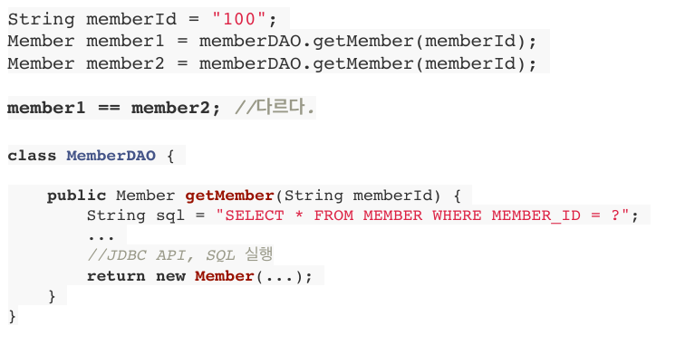
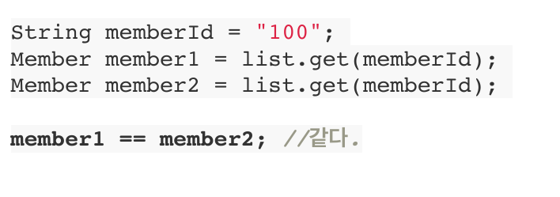

> [자바 ORM 표준 JPA 프로그래밍 - 기본편](https://www.inflearn.com/course/ORM-JPA-Basic/dashboard)을 보고 정리한 글 입니다.

## SQL 중심적인 개발의 문제점

- SQL 매핑 무한 반복
- 패러다임의 불일치
    - 관계형 데이터베이스: 데이터를 정규화하여 보관하는 것이 목표
    - 객체: 속성과 기능(필드와 메서드)를 묶고 캡슐화하여 사용하는 것이 목표

## 객체와 관계형 데이터베이스의 차이

- 상속
    - 객체 상속 관계를 슈퍼타입 서브타입 관계 표현
        
        ⇒ 조회할 때 매번 조인, 각각의 객체 생성함, **DB에 저장할 객체에는 상속관계 X**
        
- 연관관계
    - 객체: 참조하는 쪽에서만 조회 가능(단방향)
    - 테이블: 외래키(FK)가 있는 테이블 모두 조회 가능(양방향)
- 데이터 타입
    - 객체만 사용할 경우
        - 객체 그래프 탐색: .get객체명()을 사용하여 객체를 자유롭게 탐색
    - RDB를 사용하면 나오는 문제
        - SQL에 따라 탐색 범위 결정
        - 엔티티 신뢰문제
            - 어떤 쿼리가 실행되고 반환되는 지 알 수 없기에 신뢰할 수 없음
        
        ⇒ 진정한 의미의 계층 분할이 어렵다
        
- 데이터 식별 방법
    - DAO
    
        
    - 자바 컬렉션
    
    
    

## 결론

객체답게 모델링 → 매핑 작업 증가 → **자바 컬렉션처럼 DB에 저장하는 방법 고안 → JPA 탄생**

## JPA

- Java Persistence API
- 자바 진영의 **ORM** 기술 표준
- JPA는 인터페이스의 모음
- JPA가 나온 역사
    - EJB(자바진영에서 나온거) →  하이버네이트(EJB로 개발하다 빡친 개발자가 만든거) →  JPA(그 개발자 데리고 자바진영에서 만든거)

## JPA를 사용해야 하는 이유

- 생산성
- 유지보수
- 패러다임 불일치 해결
- 자유로운 객체 그래프 탐색

## ORM

- Object-relational mapping(객체 관계 매핑)
- ORM 프레임워크가 RDB와 객체 사이에서 매핑
- 객체 중심적인 개발 가능
- 객체와 RDB 위에 있는 기술

## 성능 최적화 기능

- 1차 캐시와 동일성 보장
    - 같은 트랜젝션 안에서는 같은 엔티티를 반환
    - 예) 첫번째 JPA 조회문은 SQL 쿼리를 날리고, 두번째 JPA 조회문은 첫번째 조회문의 캐시값을 가짐
- 트랜잭션 쓰기 지연
    - 트랜젝션을 커밋할 때 SQL문을 한번에 보냄
- 지연로딩
    - 객체가 실제 사용될 때 로딩
- 즉시로딩
    - JOIN SQL로 한번에 연관된 객체까지 미리 조회