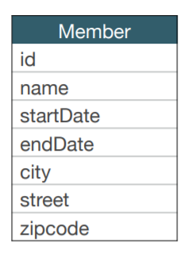
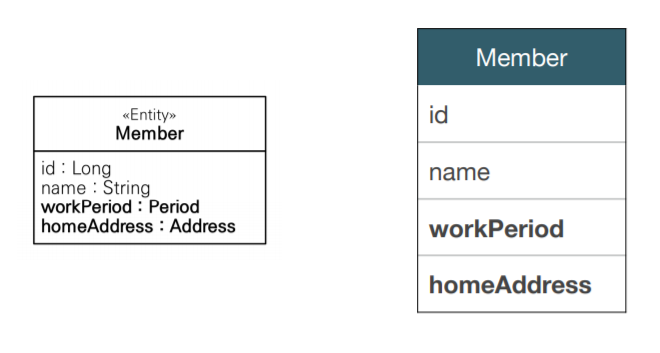
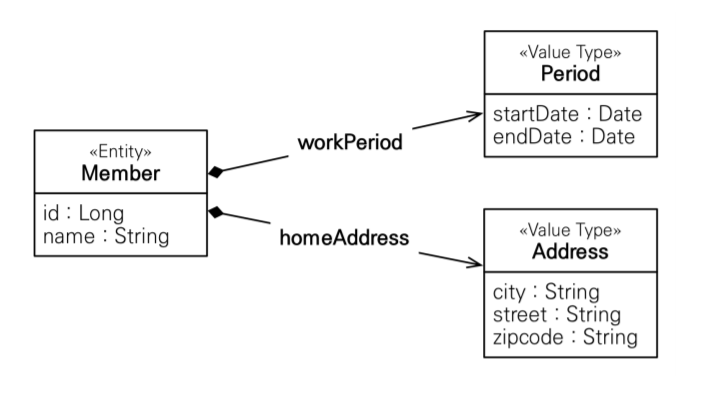
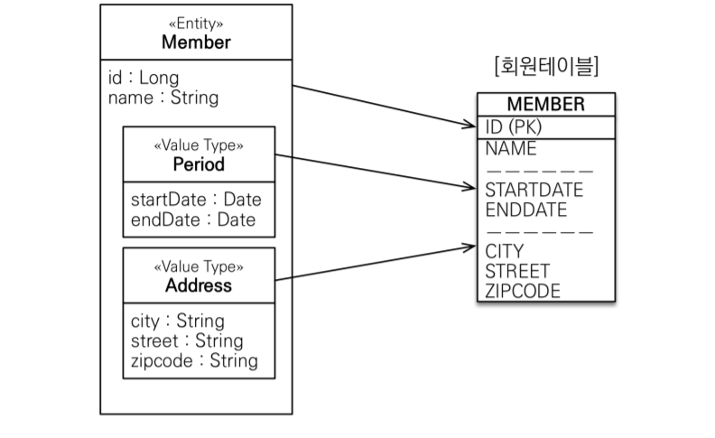
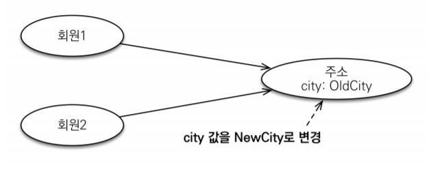
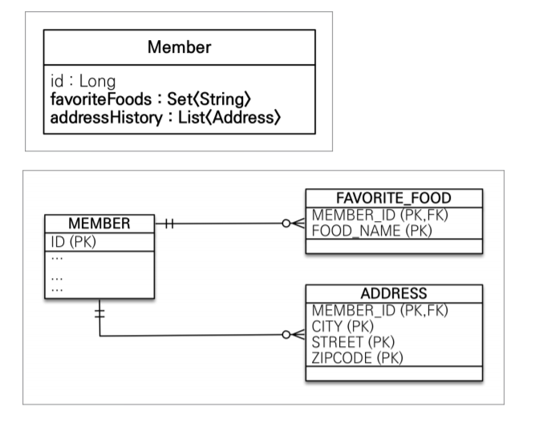

# 기본값 타입

### JPA의 타입 분류

- 엔티티 타입
    - @Entity로 정의하는 객체
    - 데이터가 변해도 **식별자로 지속해서 추적 가능**
    - 예) 회원 엔티티의 키나 나이 값을 변경해도 식별자로 인식 가능
- 값 타입
    - int, Integer, String처럼 단순히 값으로 사용하는 자바 기본 타입이나 객체
    - 식별자가 없고 값만 있으므로 변경 시 **추적 불가**
    - 예) 숫자 100을 200으로 변경하면 완전히 다른 값으로 대체

### 값 타입 분류

- 기본값 타입
    - 자바 기본 타입(int, double)
    - 래퍼 클래스(Integer, Long)
    - String
    - 생명주기를 엔티티에 의존함
        - 예) 회원을 삭제하면 이름, 나이 필드를 함께 삭제
    - 값 타입은 공유 X(사이드 이펙트 X)
        - 예) 회원 이름 변경시 다른 회원의 이름도 함께 변경되면 안됨
- 임베디드 타입(복합값 타입)
    - 새로운 값 타입을 직접 정의해서 사용할 수 있는 타입
    - 예) xy 좌표를 묶어서 사용하고 싶을 때 임베디드 타입으로 만들어서 사용
- 컬렉션 값 타입
- 참고
    - int, doble 같은 기본 타입은 절대 공유되지 않음
    - 기본 타입은 항상 값을 **복사함**
    - 래퍼 클래스, String은 공유 가능한 객체이지만 초기값을 넣은 후에는 변경을 불가능하게 함

# 임베디드 타입

- 새로운 값을 직접 정의할 수 있음
- JPA는 임베디드 타입임
- 주로 기본 값 타입을 모아 만들어서 복합 값 타입이라고도 함
- int, String과 같은 값 타입 ⇒ 추적 안되고 변경 불가능
 

  


- 회원 엔티티는 이름, 근무 시작일, 근무 종료일, 주소 도시, 주소 번지, 주소 우편번호를 가짐
  - 중복된 속성을 묶어서 추상화하면 회원 엔티티는 이름, 근무 기간, 집 주소를 가짐
    

### 임베디드 타입 사용법

- `@Embeddable`: 값 타입을 정의하는 곳에 표시(Period, Address)
- `@Embedded`: 값 타입을 사용하는 곳에 표시(Member의 Address 객체)
- 기본 생성자 필수
- 임베디드 타입의 값이 null이면 매핑한 컬럼값은 모두 null

### 임베디드 타입의 장점

- 재사용성
- 높은 응집도
- 해당 값 타입만 사용하는 의미 있는 메소드를 만들 수 있음
- 임베디드 타입을 포함한 모든 값 타입은, 값 타입을 소유한 엔티티에 생명주기를 의존함

### 임베디드 타입과 테이블 매핑


- 임베디드 타입은 **엔티티의 값**일 뿐이다
- 임베디드 타입을 사용하기 전과 후에 **매핑하는 테이블은 같다**
- 차이점은 객체와 테이블을 아주 세밀하게 매핑하는 것이 가능한 것
- 잘 설계한 ORM 애플리케이션은 매핑한 테이블 수보다 클래스 수가 더 많음

### @AttributeOverride: 속성 재정의

- 한 엔티티에서 같은 값 타입을 사용할 때 컬럼명이 중복되지 않게 함
- `@AttributeOverrides`, `@AttributeOverride`를 사용해서
컬러 명 속성을 재정의(사용방법은 어노테이션 정의 참조)

# 값 타입과 불변 객체

> 값 타입은 복잡한 객체 세상을 조금이라도 단순화하려고 만든 개념이다. 따라서 값 타입은 단순하고 안전하게 다룰 수 있어야 한다.
> 

### 값 타입 공유 참조

- 여러 엔티티에서 같은 임베디드 타입 값을 공유하면 위험함
- 사이드 이펙트가 발생해서 컴파일러에서 오류를 찾을 수 없음
- 같은 객체를 참조했기 때문에 참조한 객체를 변경하면 모두 변경됨


```java
Address address = new Address("OldCity", "샤이닝골드", "1234");

Member member1 = new Member();
member1.setUsername("차학연");
member1.setHomeAddress(address);
em.persist(member1);

Member member2 = new Member();
member2.setUsername("차하견");
member2.setHomeAddress(address); // 같은 Address 객체 참조
em.persist(member2);

member1.getHomeAddress().setCity("NewCity"); // 결과: 두 값 모두 NewCity로 변경
```

### 값 타입 복사


```java
Address address = new Address("OldCity", "샤이닝골드", "1234");

Member member1 = new Member();
member1.setUsername("차학연");
member1.setHomeAddress(address);
em.persist(member1);

Address copyAddress = new Address(address.getCity(), address.getStreet(), 
address.getZipcode()); // 새로운 값 타입 객체 생성

Member member2 = new Member();
member2.setUsername("차하견");
member2.setHomeAddress(copyAddress); // 복사한 값 타입 참조
em.persist(member2);

member1.getHomeAddress().setCity("NewCity"); // 결과: member1만 NewCity로 변경
```

- 값 타입의 실제 인스턴스 값을 공유하는 것은 위험하므로 대신 값(인스턴스)을 복사해서 사용

### 객체 타입의 한계

- 항상 값을 복사해서 사용하면 공유 참조로 인해 발생하는 부작용을 피할 수 있음
- 자바 기본 타입에 값을 대입하면 값을 복사해서 기본 타입은 공유 참조가 일어나지 않음
- 문제는 임베디드 타입처럼 직접 정의한 값은 **객체 타입**이여서 **참조 값을 직접 대입하는 것을 막을 방법이 없음**
- **객체의 공유 참조는 피할 수 없음**

### 불변 객체

- 생성 시점 이후 절대 값을 변경할 수 없는 객체
- 객체 타입을 **수정할 수 없게 만들면 부작용을 원천 차단함**
- **값 타입은 불변 객체로 설계해야 함**
- 생성자로만 값을 설정하고 수정자(Setter)를 만들지 않으면 됨
- 참고: Integer, String은 자바가 제공하는 대표적인 불변 객체

> 불변이라는 작은 제약으로 부작용이라는 큰 재앙을 막을 수 있다.
> 

# 값 타입 비교

- 값 타입은 인스턴스가 달라도 그 안에 값이 같으면 같은 것이라고 봐야 함
- 동일성 비교: 인스턴스의 참조 값을 비교, '==' 사용
- 동등성 비교: 인스턴스의 값을 비교, equlas() 비교 사용
- 값 타입은 equlas() 비교를 사용해야 함(참조값 이여서)
- 값 타입의 equlas() 메소드를 적절하게 재정의(주로 모든 필드 사용)해서 사용하자

equlas() 재정의를 해야 하는 이유 참조: [https://velog.io/@sonypark/Java-equals-hascode-메서드는-언제-재정의해야-할까](https://velog.io/@sonypark/Java-equals-hascode-%EB%A9%94%EC%84%9C%EB%93%9C%EB%8A%94-%EC%96%B8%EC%A0%9C-%EC%9E%AC%EC%A0%95%EC%9D%98%ED%95%B4%EC%95%BC-%ED%95%A0%EA%B9%8C)

# 값 타입 컬렉션

```java
@ElementCollection
    @CollectionTable(name = "FAVORITE_FOOD", joinColumns =
        @JoinColumn(name = "MEMBER_ID")
    )
    @Column(name = "FOOD_NAME")
    private Set<String> favoriteFoods = new HashSet<>();

    @ElementCollection
    @CollectionTable(name = "ADDRESS", joinColumns =
        @JoinColumn(name = "MEMBER_ID")
    )
    private List<Address> addressHistory = new ArrayList<>();
```

- 값 타입을 하나 이상 저장할 때 사용
- `@ElementCollection`: 값 타입 컬렉션임을 알려주는 어노테이션
- `@CollectionTable` : 값 타입 컬렉션을 저장할 테이블 이름과 컬럼 이름 지정
- 데이터베이스는 컬렉션을 같은 테이블에 지정할 수 없음
- 컬렉션을 저장하기 위해서는 별도의 테이블 필요함

### 값 타입 컬렉션 사용

- 값 타입 저장 예제
    
    ```java
    Member member = new Member();
    member.setUsername("member1");
    member.setHomeAddress(new Address("homeCity", "street", "1234"));
    
    member.getFavoriteFoods().add("치킨");
    member.getFavoriteFoods().add("족발");
    member.getFavoriteFoods().add("닭발");
    
    member.getAddressHistory().add(new Address("old1", "street", "1234"));
    member.getAddressHistory().add(new Address("old2", "street", "1234"));
    ```
    

- 값 타입 조회 예제
    
    ```java
    em.persist(member);
    em.flush();
    em.clear();
    
    System.out.println("==========================");
    Member findMember = em.find(Member.class, member.getId());
    
    // select
    List<Address> addressHistory = findMember.getAddressHistory();
    for(Address address : addressHistory) {
        System.out.println("address = " + address.getCity());
    }
    ```
    
    - 값 타입 컬렉션은 지연로딩 전략을 사용함

- 값 타입 수정 예제
    
    ```java
    // update
    findMember.getFavoriteFoods().remove("족발");
    findMember.getFavoriteFoods().add("떡볶이");
    
    //delete
    findMember.getAddressHistory().remove(new Address("old1", "street", "1234"));
    findMember.getAddressHistory().add(new Address("new1", "street", "1234"));
    
    ==============================================
    // Address 객체의 equals 오바라이드 메소드
    		@Override
        public boolean equals(Object o) {
            if (this == o) return true;
            if (o == null || getClass() != o.getClass()) return false;
            Address address = (Address) o;
            return Objects.equals(city, address.city) &&
                    Objects.equals(street, address.street) &&
                    Objects.equals(zipcode, address.zipcode);
        }
    
        @Override
        public int hashCode() {
            return Objects.hash(city, street, zipcode);
        }
    ```
    
    - 값 타입 컬렉션은 부모 객체가 라이프사이클을 관리해서 자동으로 persist 됨
    - 수정할 때 값을 삭제하고 새로 값을 넣어야 사이드이펙트(실행 중에 어떤 객체를 접근해서 변화가 일어나는 행위)가 발생하지 않음
    - 컬렉션은 equals로 값을 비교하지만 오버라이드 하지 않으면 주소값만 달라도 다른 값으로 판단하기 때문에 equals를 꼭 오버라이드해서 사용해야함
    - 쿼리문을 보면 MEMBER_ID를 기준으로 모든 데이터를 삭제하고 데이터 INSERT를 2번 함
        - 변경이 발생하면 주인 엔티티와 연관된 데이터를 모두 삭제하고 값 컬렉션에 있는 값을 모두 다시 저장하기 때문임
    - **결론은 이것을 쓰지 말자**

### 값 타입 컬렉션의 제약사항

- 값 타입은 엔티티와 다르게 식별자 개념이 없음
- 값을 변경하면 추적하기 어려움
- 컬렉션 값에 변경이 발생하면 주인 엔티티와 연관된 모든 데이터를 삭제하고, 값 타입 컬렉션에 있는 현재 값을 모두 다시 저장함
- 값 타입 컬렉션을 매핑하는 테이블은 모든 컬럼을 묶어서 기본키를 구성해야 함: **null 입력X, 중복 저장X**

### 값 타입 컬렉션 대안

- 실무에선 상황에 따라 값 타입 컬렉션 대신에 **일대다 관계를 사용**
    - 값 타입 컬렉션은 셀렉트박스처럼 값을 바꿔도 업데이트할 필요가 없는 경우에만 사용(아주 간단한 경우)
- 일대다 관계를 위한 엔티티를  만들고, 여기에서 값 타입을 사용
- **영속성 전이(Cascade) + 고아 객체 제거**를 사용해서 값 타입 컬렉션 처럼 사용
    - EX) AddressEntity
    
    ```java
    @Entity
    public class AddressEntity{
    
        @Id
        @GenerateValue
        private Long id;
        
        private Address address;
        
        public Long getId(){
            return id;
        }
        
        public void setId(Long id){
            this.id = id;
        }
    
    }
    
    ```
    
    ```java
    @OneToMany(cascade = CascadeType.ALL, orphanRemoval = true) // 필수!
    @JoinColumn(name = "MEMBER_ID")
    private List<AddressEntity> addressHistroy = new ArrayList<>()
    ```
    
    ```java
    member.getAddressHistory().add(new AddressEntity("old1", "street", "10000"));
    member.getAddressHistory().add(new AddressEntity("old2", "street", "10000"));
    ```
    

### 정리

- 엔티티 타입의 특징
    - 식별자O
    - 생명 주기 관리
    - 공유
- 값 타입의 특징
    - 식별자X
    - 생명 주기를 엔티티에 의존
    - 공유하지 않는 것이 안전(복사해서 사용)
    - 불변 객체로 만드는 것이 안전
- 값 타입은 정말 값 타입이라고 판단될 때에만 사용
- 엔티티와 값 타입을 혼동해서 엔티티를 값 타입으로 만들면 안됨
- **식별자가 필요하고, 지속해서 값을 추적, 변경해야 한다면 그것은 값 타입이 아닌 엔티티**