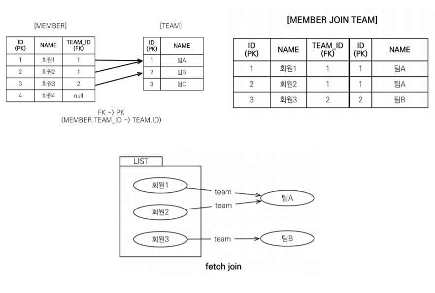
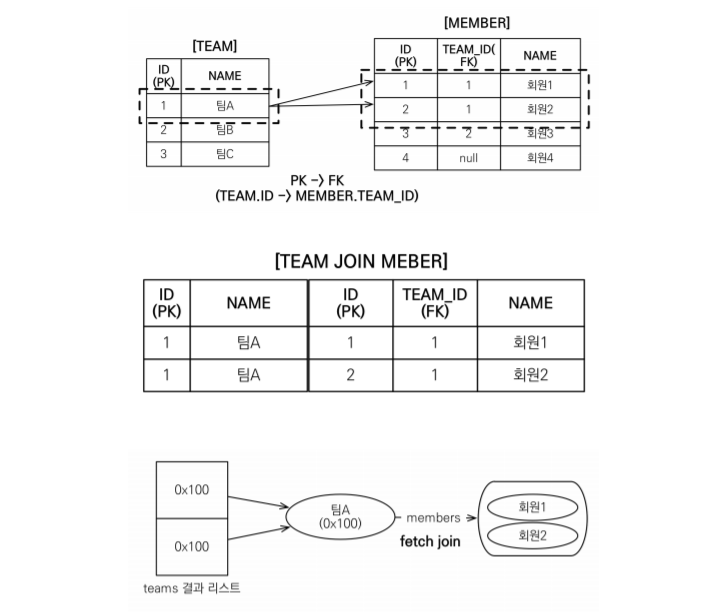
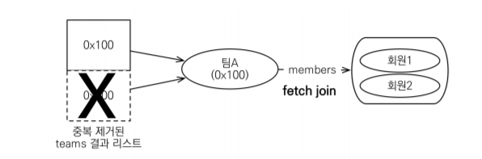

## 경로 표현식

- .을 찍어 객체 그래프를 탐색하는 것

```java
select m.username -> 상태 필드
 from Member m
 join m.team t -> 단일 값 연관 필드
 join m.orders o -> 컬렉션 값 연관 필드
where t.name = '팀A'
```

### 경로 표현식 용어 정리

- 명시적 조인: join 키워드 직접 사용
- 묵시적 조인: 경로 표현식에 의해 묵시적으로 sql 조인 발생(내부 조인만 가능)
- 상태 필드(state field)
    - 단순히 값을 저장하기 위한 필드
    - 경로 탐색의 끝, 탐색 안됨
    - ex) username, age
- 연관 필드(association field)
    - 연관 관계를 위한 필드
    - 단일 값 연관 필드
        - @ManyToOne, @OneToOne, 대상이 엔티티(ex: m.team)
        - 묵시적 내부 조인 발생(inner join), 탐색 가능
        
        ```java
        JPQL: select o.member from Order o
        
        SQL:select m.* from Orders o
         inner join Member m on o.member_id = m.id
        ```
        
    - 컬렉션 값 연관 필드
        - @OneToMany, @ManyToMany, 대상이 컬렉션(ex: m.orders)
        - 묵시적 내부 조인 발생, 탐색 안됨
        - from절에서 명시적 조인을 통해 별칭을 얻으면 별칭을 통해 탐색 가능
        
        ```java
        select m.username from Team t join t.members m; // 별칭을 통한 탐색
        ```
        

### 경로 표현식 예제

```java
select o.member.team from Order o // 성공
```

```java
select t.members from Team // 성공
```

```java
select t.members.username from Team t // 실패
```

⇒ 컬렉션은 경로 탐색을 할 수 없다

```java
select m.username from Team t join t.members m // 성공
```

⇒ 명시적 조인을 통해 별칭을 얻어서 탐색해야 한다

### 경로 탐색를 사용한 묵시적 조인 시 주의사항

- 항상 내부 조인
- 컬렉션은 경로 탐색의 끝, 명시적 조인을 통해 별칭을 얻어야함
- 경로 탐색은 주로 SELECT, WHERE 절에서 사용하지만 묵시적 조인으로 인해 SQL의 FROM (JOIN) 절에 영향을 줌
- **가급적 묵시적 조인 대신에 명시적 조인 사용하자**
    - 묵시적 조인은 조인이 일어나는 상황을 한눈에 파악하기 어려움
    - 조인은 sql 튜닝에 포인트

## 페치 조인(fetch join)

- JPQL에서 성능 최적화를 위해 제공하는 기능
- 연관된 엔티티나 컬렉션을 SQL 한 번에 함께 조회하는 기능
- join fetch 명령어 사용

### 엔티티 페치 조인



- 페치 조인은 회원을 조회하면서 연관된 팀도 함께 조회할 수 있음
- 지연 로딩으로 세팅해도 페치 조인을 사용하면 무조건 **즉시 로딩**임

```java
// JPQL
select m from Member m **join fetch** m.team
// SQL
SELECT M.*, T.* FROM MEMBER M
**INNER JOIN** TEAM T ON M.TEAM_ID=T.ID
```

```java
String jpql = "select m from Member m join fetch m.team";
List<Member> members = em.createQuery(jpql, Member.class).getResultList();

for (Member member : members) {
	 //페치 조인으로 회원과 팀을 함께 조회해서 즉시 로딩
	 System.out.println("username = " + member.getUsername() + ", " +
	 "teamName = " + member.getTeam().name());
}
```

### 컬렉션 페치 조인



```java
// JPQL
select t
from Team t **join fetch t.members**
where t.name = ‘팀A'
// SQL
SELECT T.*, **M**.*
FROM TEAM T
INNER JOIN MEMBER M ON T.ID=M.TEAM_ID
WHERE T.NAME = '팀A'
```

```java
String jpql = "select t from Team t join fetch t.members where t.name = '팀A'"
List<Team> teams = em.createQuery(jpql, Team.class).getResultList();
for(Team team : teams) {
	 System.out.println("teamname = " + team.getName() + ", team = " + team);
	 for (Member member : team.getMembers()) {
	 //페치 조인으로 팀과 회원을 함께 조회해서 지연 로딩 발생 안함
	 System.out.println(“-> username = " + member.getUsername()+ ", member = " + member);
	 }
}
```

- 일대다 조인은 DB에서 결과가 뻥튀기되어 나올 수 있음
    - EX) Team의 입장에서는 TeamA, TeamB 각각 하나의 데이터인데 Member 입장에선 TeamA에 속하는 여러개의 데이터이므로, 조인하면 '다'쪽인 Member기준으로 데이터가 출력됨
- DB의 로우 수 만큼 데이터를 받아오기 때문에 데이터 중복이 발생함
    
    ⇒ DISTINCT를 사용해서 중복 제거하자
    

### 페치 조인과 DISTINCT

- SQL의 DISTINCT는 중복된 결과를 제거하는 명령 ⇒ 모든 중복을 제거 X
- JPQL의 DISTINCT 2가지 기능 제공
    1. SQL에 DISTINCT를 추가하여 쿼리 실행
    2. 결과가 애플리케이션에 오면 SQL에서 DISTINCT를 적용한 엔티티를 중복 제거함

```java
select **distinct** t
from Team t join fetch t.members
where t.name = ‘팀A
```

```java
String query = "select distinct t from Team t join fetch t.members";
List<Team> result = em.createQuery(query, Team.class).getResultList();

for(Team team : result) { // 애플리케이션에서 중복 제거
   System.out.println("team = " + team.getName() + "|" + team.getMembers().size());
}
```



- DISTINCT가 추가로 애플리케이션에서 중복 제거
- 같은 식별자를 가진 엔티티 제거

### 페치 조인과 일반 조인의 차이

- 일반 조인 실행시 연관된 엔티티를 함께 조회하지 않음
- 일대다 조인인 컬렉션을 조회할 때 연관 엔티티를 가져오지 않기 때문에 연관 데이터는 초기화가 이루어지지 않음
- JPQL은 결과를 반환할 때 연관관계를 고려하지 않아서, 일반조인을 하면 SELECT 절에 지정한 엔티티만 조회함
- 페치 조인을 사용할 때만 연관된 엔티티도 함께 조회(즉시로딩)
- **페치 조인은 객체 그래프를 SQL 한번에 조회하는 개념**

### 페치 조인의 특징과 한계

- **페치 조인 대상에는 별칭을 줄 수 없음**
    - 하이버네이트는 O, 가급적 사용 X
    - 컬렉션의 연관관계를 찾아갈 때 모든 필드를 조회할 수 있어야 좋음
        - 영속성 컨텍스트가 관리할 때 혼돈 방지
- **둘 이상의 컬렉션은 페치 조인 할 수 없음**
- **컬렉션을 페치 조인하면 페이징API(setFirstResult, seetMaxResults)를 사용 할 수 없음**
    - 연관된 엔티티를 조회할 때 select query를 보내기 때문에 n+1 문제가 생김
        - `@BatchSize(size = 100)` 를 사용해서 해결한다(실무에선 글로벌 세팅으로  사용)
    - 일대일, 다대일 같은 단일 값 연관 필드들은 페치 조인해도 페이징 가능
    - 하이버네이트는 경고 로그를 남기고 메모리에서 페이징(매우 위험!)
- 연관된 엔티티들을 SQL 한 번으로 조회함 ⇒ 성능 최적화
- 엔티티에 직접 적용하는 글로벌 로딩 전략(FetchType.LAZY)보다 우선 실행됨
- 최적화가 필요한 곳은 페치 조인 적용

### 정리

- 모든 것을 페치 조인으로 해결할 수 는 없음
- 페치 조인은 객체 그래프를 유지할 때 사용하면 효과적
- 여러 테이블을 조인해서 엔티티가 가진 모양이 아닌 전혀 다른 결과를 내야 하면, 페치 조인 보다는 일반 조인을 사용하고 필요한 데이터들만 조회해서 DTO로 반환하는 것이 효과적

# 벌크 연산

- 재고가 10개 미만인 모든 상품의 가격을 10% 상승하려면?
- JPA 변경 감지 기능으로 실행하려면 너무 많은 SQL 실행
    
    1. 재고가 10개 미만인 상품을 리스트로 조회한다.
    
    2. 상품 엔티티의 가격을 10% 증가한다.
    3. 트랜잭션 커밋 시점에 변경감지가 동작한다.
    
- 변경된 데이터가 100건이라면 100번의 UPDATE SQL 실행

⇒ 이 문제를 해결하기 위해 벌크 연산 사용

### 예제

- 쿼리 한 번으로 여러 테이블 로우 변경(엔티티)
- `executeUpdate()`의 결과는 영향받은 엔티티 수 반환
- UPDATE, DELETE 지원
- INSERT(insert into .. select, 하이버네이트 지원)

```java
String qlString = "update Product p " +
 "set p.price = p.price * 1.1 " +
 "where p.stockAmount < :stockAmount";

int resultCount = em.createQuery(qlString).setParameter("stockAmount", 10)
 .executeUpdate();
```

### 벌크 연산 주의점

- 벌크 연산은 영속성 컨텍스트를 무시하고 데이터베이스에 직접 쿼리 보냄
    - 벌크 연산을 먼저 실행
    - 벌크 연산 수행 후 영속성 컨텍스트 초기화(`entityManager.clear(`))