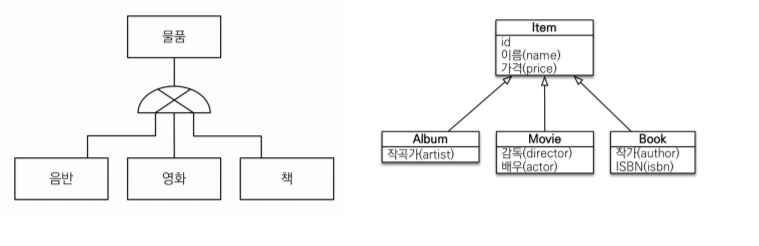
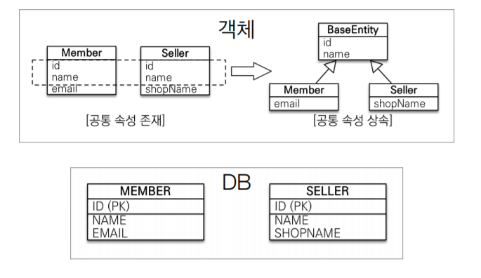

## 상속관계 매핑

- 객체의 상속 구조와 DB의 슈퍼-서브타입 관계를 매핑
- 슈퍼타입-서브타입 모델링 기법이 객체 상속과 유사함

### 조인전략

- 각각 테이블로 변환하고 조인하는 전략
- `@Inheritance(strategy = InheritanceType.JOINED)` 사용
- `@DiscriminatorColumn(name=“DTYPE”)` 사용하는 것을 권장하지만 필수는 아님
- 장점
    - 테이블 정규화
    - 외래키 참조 무결성(부모키,자식키 값 동일) 제약조건 활용 가능
    - 저장공간 효율이 좋음
- 단점
    - 조회시 조인을 많이 사용해서 성능 저하
    - 조회 쿼리가 복잡
    - 데이터 저장 시 INSERT SQL 두 번 호출

### 단일 테이블 전략

- 통합 테이블로 변환하는 전략
- `@Inheritance(strategy = InheritanceType.SINGLE_TABLE)` 사용
- `@DiscriminatorColumn(name=“DTYPE”)` 필수
- 장점
    - 조인이 필요 없으므로 조회 성능 향상
    - 조회 쿼리가 단순함
- 단점
    - 자식 엔티티(Album, Movie, Book)가 매핑한 컬럼은 null 허용
    - 단일 테이블에 저장한 모든 것을 저장해서 테이블 크기가 커질 수 있음
    - 상황에 따라 조회 성능이 느려질 수 있지만 자주 나오지 않는 상황임

### 구현 클래스마다 테이블 전략

- 구현 클래스마다 테이블로 만드는 전략
- `@Inheritance(strategy = InheritanceType.TABLE_PER_CLASS)` 사용
- DTYPE 필요없음
- **DBA와 개발자 모두 비추천하는 전략**
- 장점
    - 서브타입을 명확하게 구분해서 처리할 때 효과적
    - NOT NULL 제약조건 사용가능
- 단점
    - 여러 자식 테이블을 함께 조회할 때 UNION ALL을 사용해서 느림
    - 자식 테이블을 통합해서 쿼리하기 힘듬

## @MappedSuperclass

- 공통 매핑 정보가 필요할 때 사용
- 테이블과 관계 없고, 단순히 엔티티가 공동으로 사용하는 매핑 정보를 모으는 역할
- 부모 클래스를 상속받는 **자식 클래스에 매핑 정보만 제공**
- 엔티티가 아니므로 `@Entity` 와 같이 사용 불가능
- 추상 클래스로 사용 권장

<aside>
📌 `@Entity` 클래스는 엔티티 클래스, `@MappedSuperclass`로 지정한 클래스만 상속 가능

</aside>