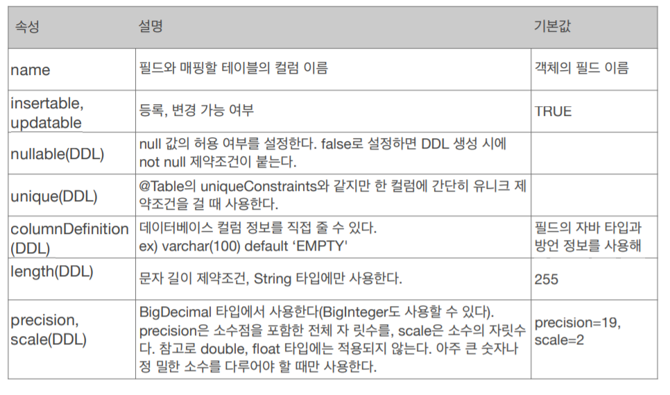
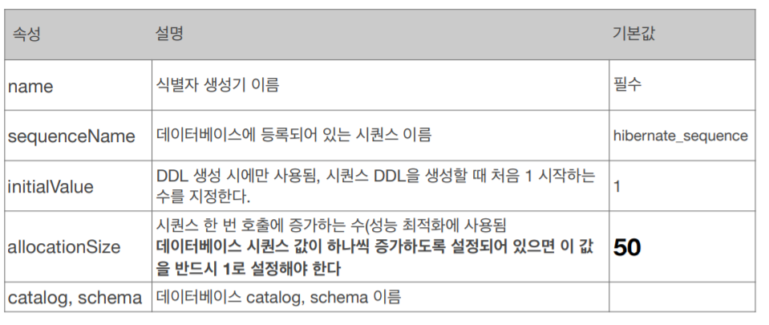
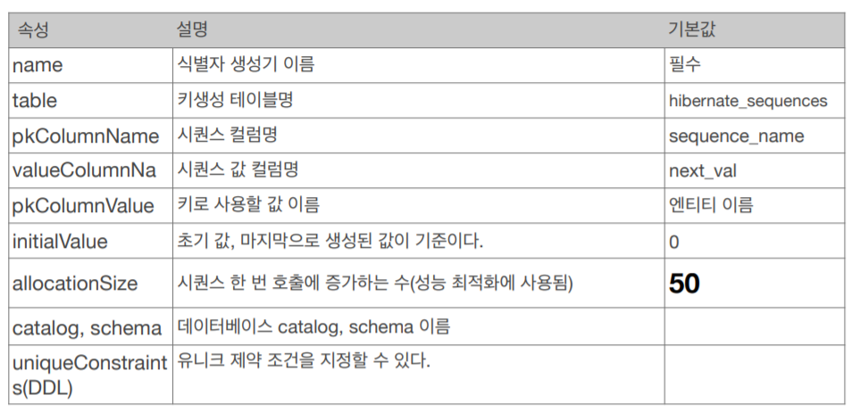

## 객체와 테이블 매핑
### @Entity
 - @Entity가 붙은 클래스는 JPA가 관리해서 엔티티라고 부름
- JPA를 사용해서 DB의 테이블과 매핑할 클래스는 **필수**로 붙혀야함
- 기본 생성자 필수로 있어야 함
 - final 클래스, enum, interface, inner 클래스 사용X
- 저장할 필드에 final 사용X
### @Table
- 엔티티와 매핑할 테이블 지정함
- 속성
   - name: 매핑할 테이블 이름
    - catalog: 데이터베이스 catalog 매핑
    - schema: 데이터베이스 schema 매핑
    - uniqueConstraints(DDL): DDL 생성 시에 유니크 제약 조건 생성

## 데이터베이스 스키마 자동 생성
DDL을 애플리케이션 실행 시점에 자동 생성
### 속성
- create: 기존테이블 삭제 후 다시 생성 (DROP + CREATE)
- create-drop: create와 같으나 종료시점에 테이블 DROP
- update: 변경분만 반영(운영DB에는 사용하면 안됨)
- validate: 엔티티와 테이블이 정상 매핑되었는지만 확인
- none(아무 문자나 적어도 상관없음): 사용하지 않음
    
⇒ **운영에서는 쓰지말고, 테스트에서는 validate까지만 쓰자**
    
### DDL 생성 기능
- 제약조건 추가: `@Column(unique = true, length = 10)`
- DDL 생성 기능은 DDL을 자동 생성할 때만 사용되고 JPA의 실행 로직에는 영향을 주지 않음
    - 예) @Table(name="")을 변경하면 DB와 객체 이름을 매핑해야 해서 JPA 실행 로직 변경
    - 예) 제약조건을 추가하고 실행했을 때 JPA에서 DDL만 생성하면됨
    
⇒ DDL 생성 기능을 쓰지 않아도 엔티티에 @Column을 써서 제약조건 같은 중요 정보를 표기해두면 JPQL를 작성할 때 인지하기 편함
    

## 필드와 컬럼 매핑
### @Column: 컬럼매핑


### @Temporal: 날짜 타입 매핑
- LocalDate, LocalDateTime을 사용할 때에는 생략 가능
- TemporalType.DATE: 날짜, 데이터베이스 date 타입과 매핑
    (예: 2013–10–11)
- TemporalType.TIME: 시간, 데이터베이스 time 타입과 매핑
    (예: 11:11:11)
- TemporalType.TIMESTAMP: 날짜와 시간, 데이터베이 스
    timestamp 타입과 매핑(예: 2013–10–11 11:11:11)
### @Enumerated: enum타입 매핑
- EnumType.ORDINAL: enum **순서(Integer)**를 데이터베이스에 저장
- EnumType.STRING: enum **이름(String)**을 데이터베이스에 저장
- **ORDINAL을 사용하면 enum타입을 추가했을 때 순서가 꼬이게 되기 때문에 꼭 STRING을 사용하자**
### @Lob: BLOB, CLOB 매핑
- 지정할 수 있는 속성이 없음
- 매핑하는 필드가 문자면 CLOB 매핑, 나머지는 BLOB 매핑
### @Transient: 특정 필드를 컬럼에 매핑하지 않음(매핑 무시)
    - 필드 매핑, 데이터베이스 저장 조회 안됨
    - 주로 메모리상에서만 임시로 어떤 값을 보관하고 싶을 때 사용

## 기본키 매핑
- 직접 할당: @Id만 사용
- 자동 생성(@GeneratedValue)
    - IDENTITY: 데이터베이스에 위임, MYSQL에서 사용
    - SEQUENCE: 데이터베이스 시퀀스 사용, ORACLE에서 사용
        - @SequenceGenerator 필요
    - TABLE: 키 생성용 테이블 사용, 모든 DB에서 사용
        - @TableGenerator 필요
    - AUTO: 데이터베이스 방언에 따라 자동 지정, 실무에선 사용 X

### IDENTITY 전략
- 기본키 생성을 데이터베이스에 위임
- 주로 MySQL, PostgreSQL, SQL Server, DB2에서 사용(예: MySQL의 AUTO_ INCREMENT)
- INSERT SQL를 실행 후에 ID값을 알 수 있음 ⇒ 커밋하지 않으면 영속성 컨텍스트에 ID값을 넣을 수 없음
    - em.persist() 시점에 즉시 INSERT SQL를 실행하고 DB에서 식별자를 조회함
    - 버퍼링 방식을 사용할 수 없음

```java
@Entity
public class Member {
 @Id
 @GeneratedValue(strategy = GenerationType.IDENTITY)
 private Long id;
```

### SEQUENCE 전략

- 오라클, PostgreSQL, DB2, H2 데이터베이스에서 사용
- 시퀀스 값을 먼저 호출을 하고 영속성 컨텍스트에 저장하기 때문에 IDENTITY 방식과 달리 버퍼링 방식이 가능함

```java
@Entity
@SequenceGenerator(
 name = “MEMBER_SEQ_GENERATOR",
 sequenceName = “MEMBER_SEQ", //매핑할 데이터베이스 시퀀스 이름
 initialValue = 1, allocationSize = 50)
public class Member {
 @Id
 @GeneratedValue(strategy = GenerationType.SEQUENCE,
 generator = "MEMBER_SEQ_GENERATOR")
 private Long id;
```


- SEQUENCE를 여러번 호출하면 성능이 떨어지기 때문에 allocationSize를 사용해 최적화함
    - DB에 시퀀스를 호출할 때 allocationSize값만큼 증가시켜놓고, 메모리에서 미리 호출한 시퀀스 값을 사용함
    - 메모리에서 allocationSize값을 다 사용했다면 다시 DB에 시퀀스를 allocationSize값만큼 호출함
    
    ```java
    try {
                Member member1 = new Member();
                member1.setUsername("A");
    
                Member member2 = new Member();
                member1.setUsername("B");
    
                Member member3 = new Member();
                member1.setUsername("C");
    
                System.out.println("==================");
    
                em.persist(member1); // 1, 51번까지 시퀀스 호출
                em.persist(member2); // 메모리에서 호출
                em.persist(member3); // 메모리에서 호출
    
                System.out.println("member1 = " + member1.getId());
                System.out.println("member2 = " + member2.getId());
                System.out.println("member3 = " + member3.getId());
    
                System.out.println("==================");
    
                tx.commit();
            }
    
    ```
    

### Table 전략

- 키 생성 전용 테이블을 만들어서 데이터베이스 시퀀스를 흉내내는 전략
- 장점: 모든 데이터베이스에 적용 가능
- 단점: 성능이 좋지 않음(SEQUENCE 전략처럼 성능 최적화를 하자)
- 많이 사용 안하는 전략

```java
@Entity
@TableGenerator(
 name = "MEMBER_SEQ_GENERATOR",
 table = "MY_SEQUENCES",
 pkColumnValue = “MEMBER_SEQ", allocationSize = 1)
public class Member {
 @Id
 @GeneratedValue(strategy = GenerationType.TABLE,
 generator = "MEMBER_SEQ_GENERATOR")
 private Long id;
```

```java
create table MY_SEQUENCES (
 sequence_name varchar(255) not null,
 next_val bigint,
 primary key ( sequence_name )
)
```


### 권장하는 식별자 전략
- 기본키 제약조건(NULL 아님, 유일값, 값 변경X)을 차후까지 만족하는 자연키를 찾기 어려움
- 대리키(대체키)를 사용하는 것을 권장
- 권장: **Long형(10억 이상 사용하기 위해) + 대체키 + 키 생성전략(시퀀스, UUID 등) 사용**