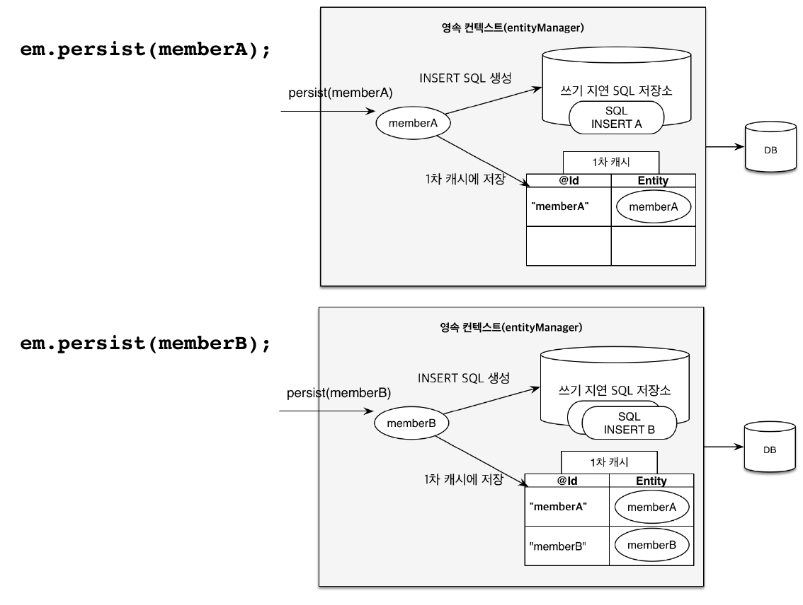
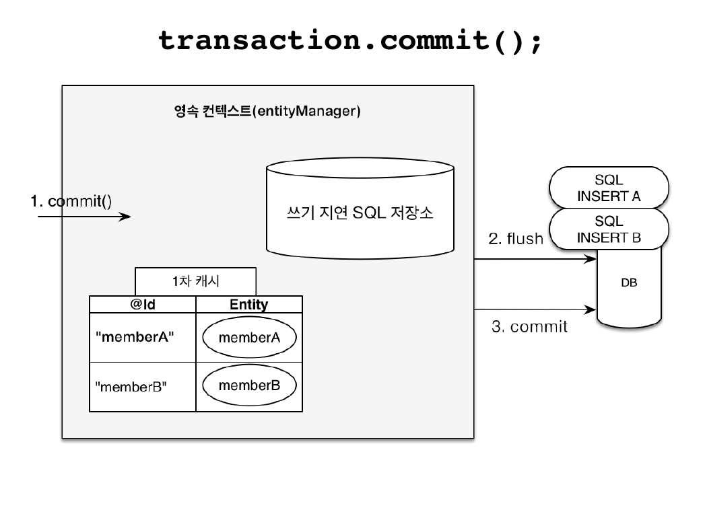
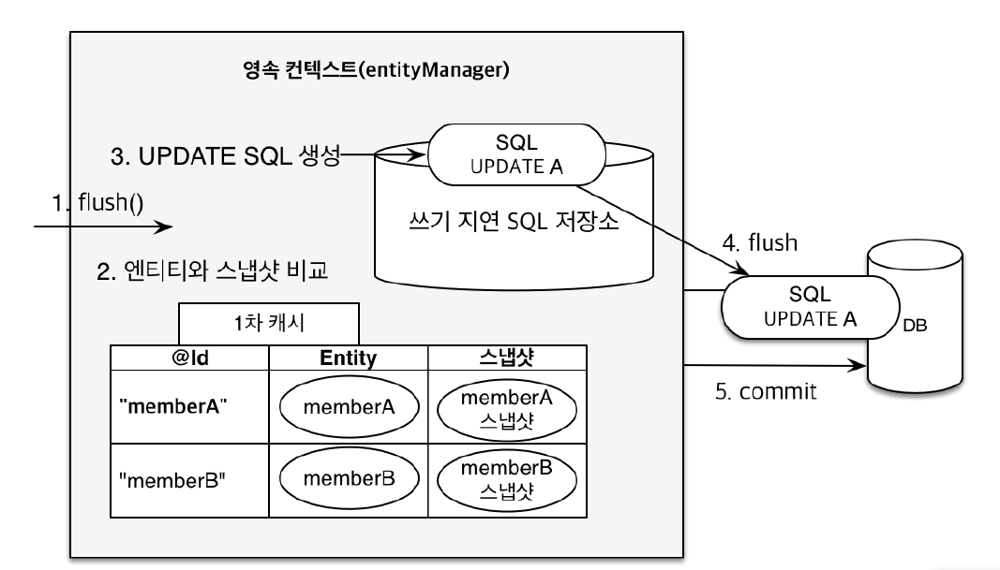

## 영속성 컨텍스트

- 엔티티를 영구 저장하는 환경
- `EntityManager.persist(entity);`를 통해 영속성 컨텍스트에 접근
- 논리적인 개념(보이지 않음)
- EntityManger 안에 영속성 컨텍스트가 있음
- 1차캐시를 영속성 컨텍스트로 보면 됨

### 엔티티의 생명주기
- 비영속
    - jpa와 상관없이 객체만 생성한 상태
- 영속
    - 영속성 컨텍스트에 속한 상태
- 준영속
    - 영속성 컨텍스트에서 저장되었다가 분리
- 삭제
    - 영속성 컨텍스트에서 삭제된 상태

## 1차 캐시

- @Id의 값이 key값이 되고 엔티티 자체가 value가 됨(Map 형태)
- DB에 값을 조회할 경우, 1차 캐시에서 먼저 찾고 캐시에 값이 없으면 DB에서 값을 찾음
- 한 트랜젝션 안에서의 캐시여서 데이터 조회할 때 큰 이점은 없음

## 영속 엔티티의 동일성 보장

- 자바 컬렉션처럼 '=='비교를 할수 있다.
- 1차 캐시가 있기 때문에 애플리케이션 단위에서 비교가 가능해짐
- 같은 트랜젝션 안에서만 가능(1차 캐시에서 비교해서)

## 트랜젝션을 지원하는 쓰기 지연

- DML을 쓰기 지연 SQL 저장소에 저장하고, 트랜젝션 커밋하면 DB에 한꺼번에 보내고(flush) 저장한다.
  

- jdbc batch를 사용하여 지정해둔 사이즈만큼 쿼리를 한 번에 보냄

## 변경 감지

- 스냅샷(값을 처음 읽어온 시점의 값)과 1차 캐시의 엔티티와 비교하여 변경 사항이 있으면 트랜젝션 시점에 update query를 보냄
- 리스트의 값을 수정하고 다시 값을 주입하지 않는 것처럼, 수정하고 persist를 사용하지 않아도 된다

## 플러시

- 영속성 컨테스트의 변경내용을 데이터베이스에 동기화
- 데이터베이스에 값만 보내기 때문에 영속성 컨텍스트를 비우지 않음

## 플러시 발생

1. commit 실행 시에 변경 감지(영속성 컨텍스트와 스냅샷 비교)
2. 변경된 엔티티를 쓰기지연 sql 저장소에 등록
3. 쓰기 지연 sql 저장소의 쿼리를 DB에 전송

## 영속성 컨텍스트를 플러시하는 방법

- `em.flush()`: 직접 호출
- 트랜젝션 커밋: 자동 호출
- JPQL 쿼리 실행: 자동 호출
    - persist보다 JPQL의 조회가 먼저 실행되어 오류가 발생할 수 있어서 자동호출임

## 준영속 상태

- 영속 상태의 엔티티가 영속성 컨텍스트에서 분리
- 영속성 컨텍스트에서 제공하는 기능 사용 불가능

## 준영속 상태로 만드는 방법

- `em.detach(entity)`: 특정 엔티티만 준영속 상태로 전환
- `em.clear()`: 영속성 컨텍스트를 완전히 초기화
- `em.close()`: 영속성 컨텍스트를 종료