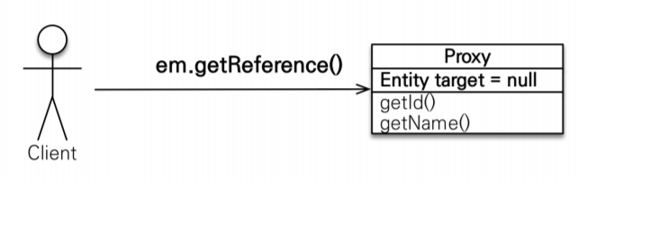
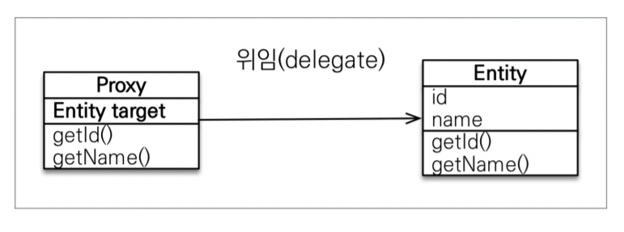
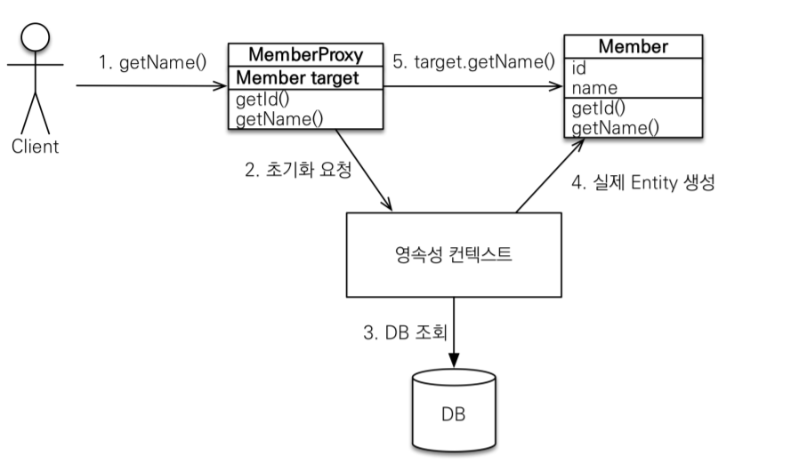
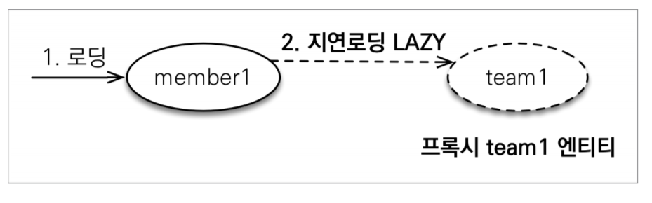
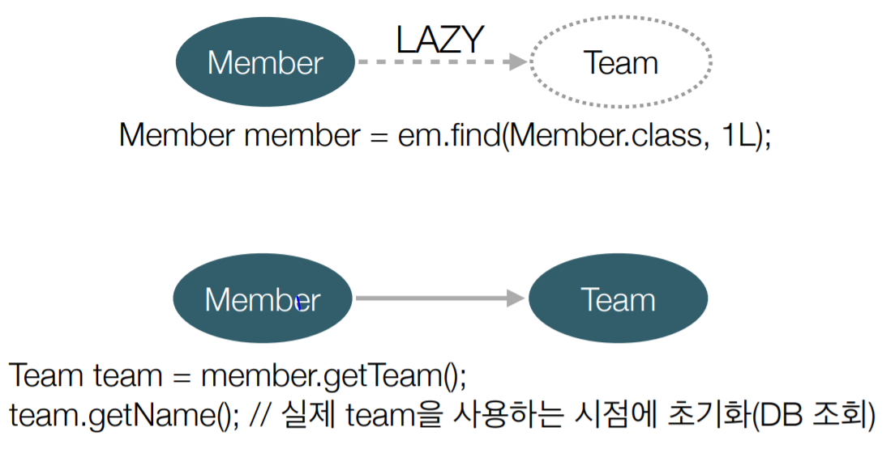
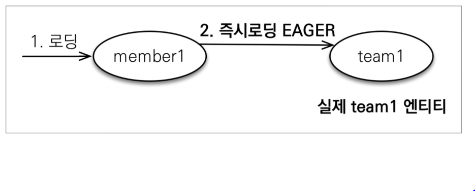
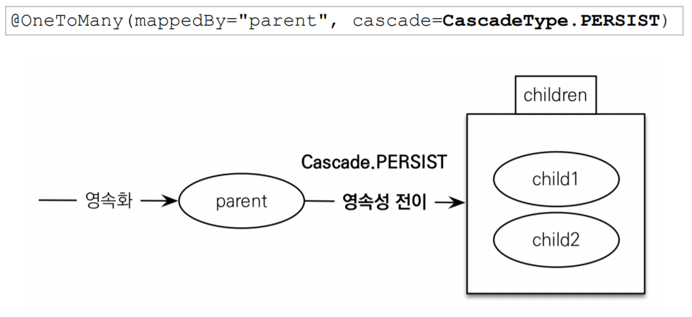

# 프록시

- 하나의 엔티티를 조회할 때 연관된 엔티티도 같이 조회해야 할까?(Member, Team 엔티티)
    - 비즈니스 상황마다 다르다
    - 하나의 엔티티만 출력할 땐 낭비다
    - JPA는 지연로딩과 프록시로 이 상황을 해결한다

### 프록시 기초

- `em.find()` : 데이터베이스를 통해서 실제 엔티티 객체 조회
- `em.getReference()` : 데이터베이스 조회를 미루는 가짜 엔티티(프록시) 객체 조회
    - 실제로 엔티티 객체를 사용하는 시점에 쿼리가 나간다


### 프록시 특징

- 실제 클래스를 상속 받아서 만들어짐
- 실제 클래스와 겉 모양이 같음
- 사용하는 입장에선 진짜 객체인지 프록시 객체인지 구분하지 않고 사용하면 됨(이론상)
- 프록시 객체는 실제 객체의 참조를 보관함
- 프록시 객체를 호출하면 프록시 객체는 실제 객체의 메소드를 호출함


### 프록시 객체의 초기화

```java
Member member = em.getReference(Member.class, “id1”); // 프록시 사용
member.getName(); // 실제 엔티티 사용 시점(쿼리 보냄)
```


1. `getName()` 을 호출하면 Member 프록시 객체의 참조(target)를 본다
2. 처음엔 참조값이 없으므로 영속성 컨텍스트에 Member 객체를 요청한다
3. 영속성 컨텍스트는 DB조회 후 실제 엔티티 객체를 생성한다
4. 실제 엔티티 객체(Member)에 프록시 객체의 참조를 연결한다
5. `target.getName()`을 통해서 실제 객체의 `getName()` 이 반환된다

### 프록시의 특징 정리

- 프록시 객체는 처음 사용할 때 한 번만 초기화
- 프록시 객체가 초기화되면 프록시 객체를 통해 실제 엔티티 객체에 접근 가능
    - target에 참조값만 채워지는 것이지 실제 엔티티로 변하는 것은 아님
- 프록시 객체는 **원본 엔티티를 상속 받음**
    - 따라서 타입 체크시 주의해야함(`==` 은 false, 대신 `instance of` 사용)
- 영속성 컨텍스트에 찾는 엔티티가 이미 있으면 `em.getReference()` 를 호출해도 프록시 객체가 아닌 실제 엔티티를 반환함
    
    ```java
    Member find = em.find(Member.class, member.getId());
    Member reference = em.getReference(Member.class, member.getId());
    
    System.out.println("find == reference : " + (find == reference)); // true
    ```
    
    - 값이 다를 것으로 예상되지만 두 객체의 값은 같다
    - 이미 영속성 컨텍스트에 올려논 객체를 프록시로 다시 감싸서 반환하는게 비효울적이라서 JPA는 영속성 컨텍스트에 있는 객체를 사용한다
    - **JPA는 하나의 영속성 컨텍스트에서 조회하는 같은 엔티티의 동일성을 보장한다**
    - 만약 둘 다 `getReference()` 를 호출하거나 혹은, `getReference()` 후 `em.find()` 를 호출하면 어떻게 될까?
        - 한 트랜젝션 안에서 같은 엔티티의 동일성 보장을 위해 둘 다 프록시 객체를 조회한다.
- 영속성 컨텍스트의 도움을 받을 수 없는 준영속 상태일 때, 프록시를 초기화하면 문제 발생(트랜젝션 범위 밖에서 프록시 객체를 조회하려할 때 생기는 문제)
    - 실무에서 많이 만나는 문제
    - 하이버네이트는 org.hibernate.LazyInitializationException 예외를 터트림

### 프록시 관련 Utils

- 프록시 인스턴스의 초기화 여부 확인
`PersistenceUnitUtil.isLoaded(Object entity)`
- 프록시 클래스 확인 방법
`entity.getClass().getName()`
    
    ⇒ 출력: ..javasist.. or HibernateProxy…
    
- 프록시 강제 초기화
`org.hibernate.Hibernate.initialize(entity);`
- 참고: JPA 표준은 강제 초기화 없음
    - 그냥 프록시 객체에서 getXXX해서 강제 초기화하자

# 즉시로딩과 지연로딩

### 지연로딩 조회

```java
@Entity
 public class Member {
	 @Id
	 @GeneratedValue
	 private Long id;
	 @Column(name = "USERNAME")
	 private String name;
	 
	 @ManyToOne(fetch = FetchType.LAZY) // 지연로딩
	 @JoinColumn(name = "TEAM_ID")
	 private Team team;
	 ..
 }
```

```java
try {
            Team team = new Team();
            team.setName("가보자고");
            em.persist(team);

            Member member1 = new Member();
            member1.setUsername("member1");
            member1.setTeam(team);

            em.persist(member1);

            em.flush();
            em.clear();

            Member m = em.find(Member.class, member1.getId());

						// 결과: m = class hellojpa.Team$HibernateProxy$CIiiZIWB
            System.out.println("m = " + m.getTeam().getClass());
					
            m.getTeam().getName(); // Team 조회 쿼리문 날림
            tx.commit();
        }
```




- member1을 조회할 때 연관관계 엔티티를 프록시로 가져옴
- LAZY 속성인 엔티티 객체를 사용할 때 프록시에서 초기화 요청 ⇒ 실제 연관관계 엔티티 생성

### 즉시로딩 조회

```java
@Entity
 public class Member {
	 @Id
	 @GeneratedValue
	 private Long id;
	 @Column(name = "USERNAME")
	 private String name;
	 
	 @ManyToOne(fetch = FetchType.EAGER) // 즉시로딩
	 @JoinColumn(name = "TEAM_ID")
	 private Team team;
	 ..
 }
// 결과: 한번에 모든 쿼리 가져옴
```


- JPA 구현체는 가능하면 조인을 사용해서 SQL 한번에 조회

### 프록시와 즉시로딩 주의

- **가급적 지연로딩만 사용(특히 실무에서)**
- 즉시 로딩이면 예상하지 못한 SQL 발생
- **즉시 로딩은 JPQL에서 N+1(하나의 쿼리가 여러 쿼리를 발생) 문제를 일으킴**
    - JPQL은 SQL을 번역한 것이기 때문에 즉시 로딩이면 연관관계 엔티티를 여러 쿼리로 나눠서 가져온다
- xxxToOne은 기본이 **즉시 로딩→ LAZY로 설정**
- **JPQL fetch 조인이나, 엔티티 그래프 기능을 사용하자**

# 영속성 전이(CASECADE)와 고아 객체

### 영속성 전이

- 특정 엔티티를 영속 상태로 만들 때 연관된 엔티티도 함께 영속 상태로 만듬
- `cascade=CascadeType.PERSIST` 사용
- 예) 부모 엔티티를 저장할 때 자식 엔티티도 함께 저장


- 주의사항
    - 영속성 전이는 연관관계를 매핑하는 것과 아무 관련이 없음
    - 엔티티를 영속화할 때 연관된 엔티티를 함께 영속화하는 편리함만 제공하는 것임

### CASECADE의 종류

- **ALL: 모두 적용**
- **PERSIST: 영속**
- **REMOVE: 삭제**
- MERGE: 병합
- REFRESH: REFRESH
- DETACH: DETACH

# 고아 객체

- 고아 객체 제거: 부모 엔티티와 연관관계가 끊어진 자식 엔티티를 자동으로 삭제
- `orphanRemoval = true` 사용

```java
@OneToMany(mappedBy = "parent", cascade = CascadeType.ALL, orphanRemoval = true)
private List<Child> childList = new ArrayList<>();

...

Parent findParent = em.find(Parent.class, parent.getId());
findParent.getChildList().remove(0); // 자식 엔티티를 컬렉션에서 제거
```

     ⇒ 자동으로 고아 객체의 대한 DELETE 쿼리가 실행된다

### 주의 사항

- **참조하는 곳이 하나일 때에만 사용해야함**
- **특정 엔티티가 개인 소유일 때 사용**
- `@OneToOne`, `@OneToMany`만 사용 가능
- CasecadeType.REMOVE처럼 동작함

# 영속성 전이 + 고아 객체, 생명주기

- `CascadeType.ALL + orphanRemovel=true`
- 두 옵션을 모두 활성화 하면 부모 엔티티를 통해서 자식의 생명 주기를 관리할 수 있음
    - 예) 부모 엔티티가 `em.persist()` , `Parent.getChlidList().remove(0)` 을 하면 자식의 영속성 컨텍스트가 추가되거나 삭제됨
- 도메인 주도 설계(DDD)의 Aggregate Root 개념을 구현할 때 유용
    - Aggragate Root에 대한 참고: [https://eocoding.tistory.com/36](https://eocoding.tistory.com/36)