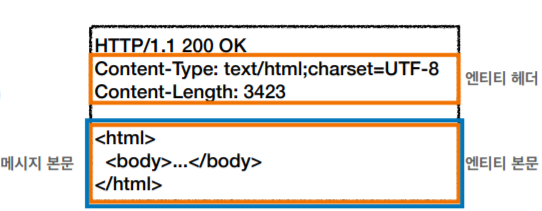
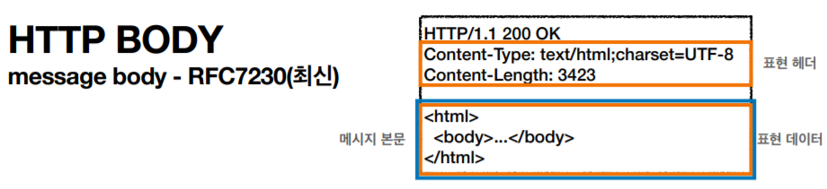
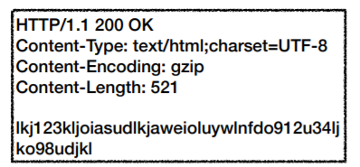
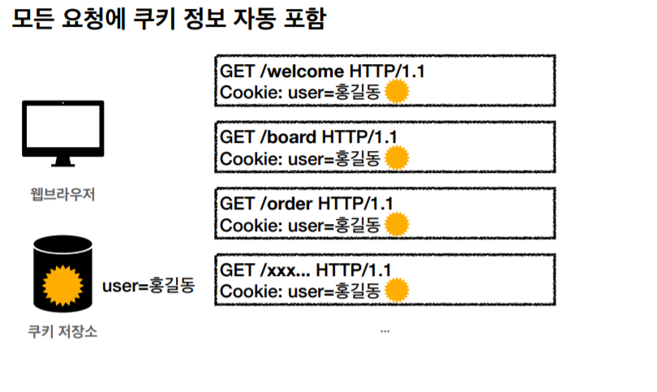

# IP(인터넷 프로토콜)

- 지정한  IP주소에 데이터 전달하기 위한 규칙
- 패킷(Packet)이라는 통신 단위로 데이터 전달

- 출발 지점(클라이언트)IP와 목적 지점(서버)IP, 기타 정보를 가진 것이 **패킷**

## IP 프로토콜의 한계

#### 비연결성
- 패킷을 받을 대상이 없거나 서비스 불능 상태에서도 패킷 전송
        
        
        
#### 비신뢰성
- 중간에 패킷이 사라질 수 있음
- 패킷이 순서대로 오지 않을 수 있음(데이터가 클 경우 나눠서 옴)
        

        

        
#### 프로그램 구분
- 같은 IP를 사용하는 서버에서 통신하는 다른 애플리케이션들을 구분하지 못함

# TCP와 UDP

## 인터넷 프로토콜의 4계층

- 애플리케이션 계층 - HTTP, FTP
- 전송 계층 - TCP, UDP
- 인터넷 계층 - IP
- 네트워크 인터페이스 계층

⇒ 단계마다 하나에 패킷에 각각의 패킷 정보을 추가함

## TCP 특징(전송 제어 프로토콜)

#### 연결지향 - TCP 3 way handshake(가상 연결)

#### 데이터 전달 보증

#### 순서 보장

- 신뢰할 수 있는 프로토콜
- 현재 대부분 사용함
    
    

## TCP 3 way handshake

- SYN(접속 요청)과 ACK(요청 수락)를 3번 주고 받은 후 데이터를 전송
    - 최근엔 3번에서 데이터 전송이 이루어지기도 함

## UDP 특징(사용자 데이터그램 프로토콜)

- 기능이 거의 없음(하얀 도화지에 비유)
- TCP 3 way handshake X
- 데이터 전달 보증 X
- 순서 보장 X
- 데이터 전달 순서가 보장되지 않지만, 단순하고 빠름
- IP와 거의 같다. ⇒PORT와 체크섬(메세지 검증 데이터)
- 애플리케이션에서 추가 작업 필요

  
# PORT

- 한글로 번역하면 항구 ⇒ 출발과 도착 지점이라고 생각하자
- 같은 IP 내에서 프로세스를 구분/

## PORT 번호

- 0 ~ 65535 할당 가능
- 0 ~ 1023: 잘 알려진 포트, 사용하지 않는 것이 좋음
    - FTP - 20, 21
    - TELNET - 23
    - HTTP - 80
    - HTTPS - 443

# DNS

## IP의 단점

- 기억하기 어렵다
- IP가 변경될 경우 찾아갈 수 없다

## DNS(도메인 네임 시스템)

- 전화번호부 같은 것
- 도메인 명을 IP주소로 변환
- 목적 지점을 찾아갈 때 도메인 명으로 찾아감

# URI
## URI, URL, URN의 차이

- URI는 locator(위치), name 또는 둘 다 추가로 구분될 수 있음
- URI는 URL과 URN를 총괄하는 의미이다(URL과 같은 의미로 쓰기도 함)

## URI의 단어 뜻

- Uniform: 리소스를 식별하는 통일된 방식
- Resource: 자원, URI로 식별할 수 있는 모든 것(제한 없음)
- Identifier: 다른 항목과 구분하는데 필요한 정보

## URL, URN의 단어 뜻

- URL - Locator: 리소스가 있는 위치를 지정
- URN - Name: 리소스에 이름을 부여
- 위치는 변할 수 있지만 이름은 안 변함
- URN 이름만으로 실제 리소스를 찾을 수 있는 방법이 보편화 되지 않음

## URL 문법

- `scheme://[userinfo@]host[:port][/path][?query][#fragment]`
    - https://www.google.com:443/search?q=hello&hl=ko

### scheme

- 주로 프로토콜 사용
    - 프로토콜: 어떤 방식으로 자원에 접근할 것인가 하는 약속 규칙
        - 예) http, https, ftp 등
- http는 80포트, https는 443포트를 주로 사용, 포트는 생략 가능
    - https는 http에 보안 추가한 것(HTTP Secure)

### userinfo

- URL에 사용자 정보를 포함해서 인증
- 거의 사용하지 않음

### host

- 호스트명
- 도메인명 또는 IP 주소 사용

### port

- 접속 포트
- 일반적으로 생략함, 생략시 http는 80, https는 443

### path

- 리소스 경로, 계층적 구조
- 파일 디렉토리 구조와 같음
- 예 )
    - /home/file1.jpg
    - /members
    - /members/100, /items/iphone12

### query

- key=value 형태
- ?로 시작, &으로 추가
- query parameter, query string 등으로 불림, 웹서버에 제공하는 파라미터, 문자 형태

### frament

- html 내부 북마크에 사용
- 서버에 전송하는 정보 아님

# HTTP 기본

## HTTP 역사

- HTTP/0.9 1991년: GET 메서드만 지원, HTTP 헤더X
- HTTP/1.0 1996년: 메서드, 헤더 추가
- **HTTP/1.1 1997년**: 가장 많이 사용, 우리에게 가장 중요한 버전
    - RFC2068 (1997) -> RFC2616 (1999) -> RFC7230~7235 (2014)
- HTTP/2 2015년: 성능 개선
- HTTP/3 진행중: TCP 대신에 UDP 사용, 성능 개선

## 기반 프로토콜

- TCP: HTTP1.1,  HTTP/2
- UDP: HTTP/3
- 현재 HTTP/1.1 주로 사용
    - HTTP/2, HTTP/3도 점점 증가

## HTTP 특징

- 클라이언트 서버 구조
- 무상태 프로토콜(stateless), 비연결성
- HTTP 메세지
- 단순함, 확장 가능

## 클라이언트 서버 구조

- Request Response 구조
- 클라이언트는 서버에 요청을 보내고, 서버의 응답을 대기
- 서버가 요청에 대한 결과를 만들어서 응답

## 무상태 프로토콜(Stateless)

- 서버가 클라이언트 상태를 보존 X
- 장점: 서버 확장성이 높음(스케일 아웃)
- 단점: 클라이언트가 추가 데이터 전송

## Stateful, Stateless 차이점

- Stateful(상태 유지)
    - 중간에 다른 서버로 바뀌면 안됨(바뀔 경우 다른 서버에 상태 정보를 알려줘야함)
    - 예) 로그인 세션 유지
    
    
    
    
    
- Stateless(무상태)
    - 중간에 다른 서버로 바꿔도 됨
    - 갑자기 클라이언트 요청이 증가해도 서버를 대거 투입 가능
    - 응답 서버를 쉽게 바꿀 수 있다 → **무한한 서버 증설 가능**
    - 예) 로그인이 필요없는 단순한 서비스 소개 화면
    
    
    
    
    
    
    

## 비 연결성

- HTTP는 기본이 연결을 유지하지 않는 모델
- 일반적으로 초 단위의 빠른 속도로 응답
- 1시간 동안 수천명이 서비스를 사용해도 실제 서버에서 동시에 처리하는 요청은 수십개 이
하로 매우 작음
- 예) 웹 브라우저에서 계속 연속해서 검색 버튼을 누르지는 않는다.
- 서버 자원을 매우 효율적으로 사용할 수 있음

## 비 연결성 한계와 극복

- TCP/IP 연결을 새로 맺어야 함 - 3 way handshake 시간 추가
- 웹 사이트로 요청하면 css, 자바스크립트, 추가 이미지 등 수많은 자원이 함께 다운로드
- 지금은 HTTP 지속연결로 문제 해결
- HTTP/2, HTTP/3 에서 더 많은 최적화

## HTTP 메세지

### 시작 라인 - 요청 메세지

- HTTP 메서드(GET 조회)
    - 종류: GET(리소스 조회), POST(요청 내역 처리), PUT, DELETE...
    - 서버가 수행해야 할 동작 지정
- 요청 대상 (/search?q=hello&hl=ko)
    - absolute-path[?query] (절대경로[?쿼리])
    - 절대경로: "/"로 시작하는 경로
    - 참고: *, http://...?x=y 와 같이 다른 유형의 경로지정 방법도 있다.
- HTTP 버전
    - HTTP/1.1, HTTP/3 같은 버전을 나타냄

### 시작 라인 - 응답 메세지

- HTTP 버전
- HTTP 상태 코드: 요청 성공, 실패를 나타냄
    - 200: 성공
    - 400: 클라이언트 요청 오류
    - 500: 서버 내부 오류
- 이유 문구: 사람이 이해할 수 있는 짧은 상태 코드 설명 글

## HTTP 헤더

- HTTP에 필요한 모든 부가정보
- 예) 메시지 바디의 내용, 메시지 바디의 크기, 압축, 인증, 요청 클라이언트(브라우저) 정보,
서버 애플리케이션 정보, 캐시 관리 정보...

## HTTP 바디

- 실제 전송할 데이터
- HTML 문서, 이미지, 영상, JSON 등등 byte로 표현할 수 있는 모든 데이터 전송 가능

# HTTP 메서드

## API URI 설계

- 가장 중요한 것은 **리소스 식별**
- URI의 계층 구조를 활용해서 설계
- 리소스와 행위를 분리한다
    - 예시
        - 회원 목록 조회: /read-member-list →  /members
        - 회원 조회: /read-member-by-id →  /members/{id}
        - 회원 등록: /create-member → /members/{id}
        - 참고: 계층 구조상 상위를 컬렉션으로 보고 복수단어 사용 권장(member → memebers)
    - 리소스: 회원
    - 행위: 조회, 등록, 수정, 삭제

## HTTP 메서드 종류

- 주요 메서드
    - GET: 리소스 조회
    - POST: **요청 데이터 처리**, 주로 등록에 사
    - PUT: 리소스를 대체, 해당 리소스가 없으면 생성
    - PATCH: 리소스 부분 변경
    - DELETE: 리소스 삭제
- 기타 메서드
    - HEAD: GET과 동일하지만 메세지 부분을 제외하고, 상태 줄과 헤더만 반환
    - OPTIONS: 대상 리소스에 대한 통신 가능 옵션(메서드)을 설명(주로 CORS에서 사용)
    - CONNECT: 대상 자원으로 식별되는 서버에 터널을 설정
    - TRACE: 대상 리소스에 대한 경로를 따라 메세지 루프백 테스트를 수행

## GET

- 리소스 조회
- 서버에 전달하고 싶은 데이터는 query를 통해서 전달
- 메세지 바디를 사용해서 데이터를 전달할 수 있지만, 지원하지 않는 곳이 많아서 권장하지 않음

## POST

- 요청 데이터 처리
- **메세지 바디를 통해 서버로 요청 데이터 전달**
- 서버는 요청 데이터를 처리
    - 메세지 바디를 통해 들어온 데이터를 처리하는 모든 기능을 수행함
- 주로 전달된 데이터로 신규 리소스 등록, 프로세스 처리에 사용

- 리소스 URI에 POST 요청이 오면 **데이터를 어떻게 처리할지** 리소스마다 따로 정해야함
    
    ⇒ **정해진 것이 없음**
    

### POST 정리

1. 새 리소스 생성(등록)
    - 서버가 아직 식별하지 않은 새 리소스 생성
2. 요청 데이터 처리
    - 단순히 데이터를 생성하거나, 변경하는 것을 넘어서 프로세스를 처리해야 하는 경우
        - 예) 주문에서 결제완료 → 배달시작 → 배달완료 처럼 값 변경을 넘어서 프로세스의 상태가 변경되는 경우
    - POST의 결과로 새로운 리소스가 생성되지 않을 수도 있음
        - 예) POST/orders/{orderId}/start-delivery
            
            ⇒ 리소스만으로 URI를 구성할 수 없는 경우에 **컨트롤 URI**를 사용함
            
3. 다른 메서드로 처리하기 애매한 경우
    - 예) JSON으로 조회 데이터를 넘겨야하는데, GET메서드를 사용하기 어려운 경우
    - 애매하면 POST

## PUT

- 리소스를 대체
    - 리소스가 있으면 대체
    - 리소스가 없으면 생성
    - 그냥 덮어쓰기 기능
- **클라이언트가 리소스를 식별**
    - 클라이언트가 리소스 위치를 알고 URI 지정
    - POST와 큰 차이점 ⇒ POST는 리소스 위치를 모른다
- 주의점: 리소스를 완전히 대체하기 때문에 하나의 필드만 수정하고 다른 필드를 명시하지 않으면  다른 필드들은 삭제된다.
    

    

## PATCH

- 리소스 부분 변경
- PUT과 달리 하나의 필드만 변경할 때 다른 필드가 없어도 다른 필드들은 그대로 유지된다.

## DELETE

- 리소스 제거

- 캐시가능(Cacheable Methods)
    - 응답 결과 리소스를 캐시해서 사용해도 되는가?
    - GET, HEAD, POST, PATCH 캐시 가능
    - 실제로는 GET, HEAD 정도만 캐시로 사용
        - POST, PATCH는 본문 내용(BODY)까지 캐시 키로 고려해야 하는데, 구현이 쉽지 않음

# HTTP 메서드 활용
## 클라이언트에서 서버로 데이터 전송

### 데이터 전달 방식

- 쿼리 파라미터를 통한 데이터 전송
    - GET
    - 주로 정렬 필터(검색어)
- 메세지 바디를 통한 데이터 전송
    - POST, PUT, PATCH
    - 회원가입, 상품주문, 리소스 등록, 리소스 변경

### 데이터를 전달하는 4가지 상황

- 정적 데이터 조회
    - 이미지, 정적 텍스트 문서
- 동적 데이터 조회
    - 주로 검색, 게시판 목록에서 정렬 필터(검색어)
- HTML Form을 통한 데이터 전송
    - 회원 가입, 상품 주문, 데이터 변경
- HTML API를 통한 데이터 전송
    - 회원 가입, 상품 주문, 데이터 변경
    - 서버 to 서버, 앱 클라이언트, 웹 클라이언트(Ajax)

## 정적 데이터 조회

- 이미지 정적 텍스트 문서
- 조회는 GET 사용
- 정적 데이터는 일반적으로 쿼리 파라미터 없이 리소스 경로로 단순하게 조회함

## 동적 데이터 조회

- 주로 검색, 게시판 목록에서 정렬 필터(검색어)
- 조회 조건을 줄여주는 필터, 조회 결과를 정렬하는 정렬 조건에 주로 사용
- 조회는 GET를 사용
- GET은 쿼리 파라미터 사용해서 데이터 전달

## HTML Form 데이터 전송

- HTML Form Submit시 POST 전송
    - 예) 회원 가입, 상품 주문, 데이터 변경
- Content-Type: application/x-www-form-urlencoded 사용
    - form의 내용을 메세지 바디를 통해 전송(key=value, 쿼리 파라미터 형식)
    - 전송 데이터를 url encoding 처리
        - 예) abc김 -> abc%EA%B9%80
        

- HTML Form은 GET 전송도 가능
    
    

- Content-Type: multipart/form-data
    - 파일 업로드 같은 바이너리 데이터(이진 데이터) 전송시 사용
    - 다른 종류의 여러 파일과 폼의 내용 함께 전송
- 참고: HTML Form 전송은 GET, POST만 지원

## HTML API 데이터 전송

- 서버 to 서버
    - 백엔드 시스템 통신
- 앱 클라이언트
    - 아이폰, 안드로이드
- 웹 클라이언트
    - HTML Form 전송 대신 자바 스크립트를 통한 통신에 사용(AJAX)
    - 예) React, VueJs 같은 웹 클라이언트와 API 통신
- POST, PUT, PATCH: 메세지 바디를 통해 데이터 전송
- GET: 조회, 쿼리 파라미터로 데이터 전달
- Content-Type: application/json을 주로 사용 (사실상 표준)
    - TEXT, XML, JSON 등등

## HTTP API 설계

- HTTP API - 컬렉션
    - POST 기반 등록
    - 예) 회원 관리 API 제공
- HTTP API - 스토어
    - PUT 기반 등록
    - 예) 정적 컨텐츠 관리, 원격 파일 관리
- HTML FORM 사용
    - 웹 페이지 회원 관리
    - GET, POST만 지원

### 회원 관리 시스템 - 컬렉션

- 예시
    - 회원 목록 /members -> GET
    - 회원 등록 /members -> POST
    - 회원 조회 /members/{id} -> GET
    - 회원 수정 /members/{id} -> PATCH, PUT, POST
    - 회원 삭제 /members/{id} -> DELETE
- 신규 자원 등록 특징(POST)
    - **클라이언트는 등록될 리소스의 URI를 모른다**
    - **서버**가 새로 등록될 리소스 URI를 생성해준다
        - HTTP/1.1 201 Created
        Location: **/members/100**
    - 컬렉션(Collection)
        - 서버가 관리하는 리소스 디렉토리를 의미
        - **서버가 리소스의 URI의                                                                                                                                                                                                                                                                                    리소스를 생성하고 관리**
        - 여기서 컬렉션은 /members
    
    ### 파일 관리 시스템 - PUT 기반 설계
    
    - 예시
        - 파일 목록 / les -> GET
        - 파일 조회 / les/{ lename} -> GET
        - 파일 등록 / les/{ lename} -> PUT
        - 파일 삭제 / les/{ lename} -> DELETE
        - 파일 대량 등록 / les -> POST
    - 신규 자원 등록 특징(PUT)
        - **클라이언트가 등록될 리소스의 URI를 알고 있어야 한다**
            - 파일 등록 / files/{filename} -> PUT
            - PUT/**files/star.jpg**
        - 클라이언트가 직접 리소스의 URI를 지정한다
        - 스토어(Store)
            - 클라이언트가 관리하는 리소스 저장소
            - 클라이언트가 리소스의 URI를 알고 관리
            - 여기서 스토어는 /files
    
    ### HTML FORM 사용
    
    - 예시
        - 회원 목록 /members → GET
        - 회원 등록 폼 /members/**new** → GET
        - 회원 등록 /members/**new**, /members → POST
        - 회원 조회 /members/{id} → GET
        - 회원 수정 폼 /members/{id}/**edit** → GET
        - 회원 수정 /members/{id}/**edit**, /members/{id} → POST
        - 회원 삭제 /members/{id}/**delete** → POST
    - HTML FORM은 GET, POST만 지원
    - 컨트롤 URI
        - GET, POST만 지원하므로 제약이 있음
        - 이런 제약을 해결하기 위해 동사로 된 리소스 경로 활용
        - POST의 /new, /edit, /delete가 컨트롤 URI
        - HTTP 메서드로 해결하기 애매한 경우 사용(HTTP API 포함)
    
    ## 참고하면 좋은 URI 설계 개념
    
    - 문서(document)
        - 단일 개념(파일 하나, 객체 인스턴스, 데이터베이스 row)
        - 예) /members/100, / les/star.jpg
    - 컬렉션(collection)
        - 서버가 관리하는 리소스 디렉터리
        - 서버가 리소스의 URI를 생성하고 관리
        - 예) /members
    - 스토어(store)
        - 클라이언트가 관리하는 자원 저장소
        - 클라이언트가 리소스의 URI를 알고 관리
        - 예) / les
    - 컨트롤러(controller), 컨트롤 URI
        - 문서, 컬렉션, 스토어로 해결하기 어려운 추가 프로세스 실행
        - 동사를 직접 사용
        - 예) /members/{id}/delete
    
# HTTP 상태코드
## 상태코드

- **클라이언트가 보낸 요청의 처리 상태를 응답에서 알려주는 기능**
- 1xx (Informational): 요청이 수신되어 처리중
- 2xx (Successful): 요청 정상 처리
- 3xx (Redirection): 요청을 완료하려면 추가 행동이 필요
- 4xx (Client Error): 클라이언트 오류, 잘못된 문법등으로 서버가 요청을 수행할 수 없음
- 5xx (Server Error): 서버 오류, 서버가 정상 요청을 처리하지 못함

### 만약 모르는 상태 코드가 나타나면?

- 클라이언트가 인식할 수 없는 상태 코드를 서버가 반환할 경우
    - 클라이언트가 상위 상태 코드로 해석해서 처리
    - 미래에 새로운 상태 코드가 추가되어도 클라이언트를 변경하지 않아도 됨
    - 예)
        - 299 ??? -> 2xx (Successful)
        - 451 ??? -> 4xx (Client Error)
        - 599 ??? -> 5xx (Server Error)

## 1XX(Informational)

- 요청이 수신되어 처리중
- 거의 사용하지 않음

## 2XX(Successful)

- 클라이언트의 요청을 성공적으로 처리
- 200 OK

- 201 Created

- 202 Accepted
    - 요청이 접수되었으나 처리가 완료되지 않았음
    - 배치와 처리가 같은 곳에서 사용
    - 예) 요청 접수 1시간 뒤에 배치 프로세스가 요청을 처리함
- 204 No Content
    - 서버가 요청을 성공적으로 수행했지만, 응답 페이로드 본문에 보낼 데이터가 없음
    - 예) 웹 문서 편집기에서 save 버튼
    - 결과 내용이 없어도 204 메세지(2xx)만으로 성공을 인식할 수 있다

## 3XX(Redirection)

- 요청을 완료하기 위해 유저 에이전트의 추가 조치 필요
- 300 Multiple Choices
- 301 Moved Permanently
- 302 Found
- 303 See Other
- 304 Not Modified
- 307 Temporary Redirect
- 308 Permanent Redirect

## 리다이렉션

- 웹 브라우저는 3xx 응답의 결과에 Location 헤더가 있으면, Location 위치로 자동 이동(리다이렉트)
- 자동 리다이렉트 흐름
    
    
    

### 종류

- 영구 리다이렉션: 특정 리소스의 URI가 영구적으로 이동
    - 예) /memebers → /users
    - 예) /event -> /new-event
- 일시 리다이렉션: 일시적인 변경
    - 주문 완료 후 주문 내역 화면으로 이동
    - PRG: Post/Redirect/Get
- 특수 리다이렉션
    - 결과 대신 캐시를 사용

### 영구 리다이렉션

- 리소스의 URI가 영구적으로 이동
- 원래의 URL를 사용 X, 검색 엔진 등에서도 변경 인지
- 301 Moved Permanently
    
    
    
    - 리다이렉트시 요청 메서드가 GET으로 변하고, 본문이 제거될 수 있음(대부분 제거됨)
- 308 Permanent Redirect
    
    
    
    - 301과 기능은 같음
    - 리다이렉트시 요청 메서드와 본문 유지(처음 POST를 보내면 리다이렉트도 POST 유지)

## 일시적인 리다이렉션

- 리소스의 URI가 일시적으로 변경
- 따라서 검색 엔진 등에서 URL을 변경하면 안됨
- 302 Found
    - **리다이렉트시 요청 메서드가 GET으로 변하고, 본문이 제거될 수 있음(MAY)**
- 307 Temporary Redirect
    - 302와 기능은 같음
    - **리다이렉트시 요청 메서드와 본문 유지(요청 메서드를 변경하면 안된다. MUST NOT)**
- 303 See Other
    - 302와 기능은 같음
    - **리다이렉트시 요청 메서드가 GET으로 변경**

### PRG: Post/Redirect/Get

- PRG 사용전 예시
    - POST로 주문후에 웹 브라우저를 새로고침하면 중복 주문이 들어간다
    
    
    
- PRG 사용후 예시
    - POST로 주문후에 새로고침으로 인한 중복 주문 방지
    - **POST로 주문후에 주문 결과 화면을 GET 메서드로 리다이렉트**
    - 새로고침해도 결과화면을 GET으로 조회
    - 중복 주문 대신에 결과화면만 GET으로 다시 요청
    
    
    

## 4XX(Client Error)

- 클라이언트의 요청에 잘못된 문법등으로 서버가 요청을 수행할 수 없음
- 오류의 원인이 클라이언트에 있음
- **클라이언트가 이미 잘못된 요청, 데이터를 보내고 있기 때문에, 똑같은 재시도가 실
패함**
- 400 Bad Request
    - 클라이언트가 잘못된 요청을 해서 서버가 요청을 처리할 수 없음
    - 요청 구문, 메세지 등등 오류
    - 클라이언트는 요청 내용을 다시 검토하고, 보내야함
    - 예) 요청 파라미터가 잘못되거나, API 스펙이 맞지 않을 때
- 401 Unauthorized
    - 클라이언트가 해당 리소스에 대한 인증이 필요함
    - 인증(Authentication) 되지 않음
    - 401 오류 발생시 응답에 WWW-Authenticate 헤더와 함께 인증 방법을 설명
        - 참고
            - 인증(Authentication): 본인이 누구인지 확인, (로그인)
            - 인가(Authorization): 권한부여 (ADMIN 권한처럼 특정 리소스에 접근할 수 있는 권한, 인증이 있어야 인가가 있음)
- 403 Forbidden
    - 서버가 요청을 이해했지만 승인을 거부함
    - 주로 인증 자격 증명은 있지만, 접근 권한이 불충분한 경우
    - 예) 어드민 등급이 아닌 사용자가 로그인은 했지만, 어드민 등급의 리소스에 접근하는 경우
- 404 Not Found
    - 요청 리소스를 찾을 수 없음
    - 요청 리소스가 서버에 없음
    - 또는 클라이언트가 권한이 부족한 리소스에 접근할 때 해당 리소스를 숨기고 싶을 때

## 5xx (Server Error)

- 서버 문제로 오류 발생
- 서버에 문제가 있기 때문에 재시도 하면 성공할 수도 있음(복구가 되거나 등등)
- 500 Internal Server Error
    - 서버 내부 문제로 오류 발생
    - 애매하면 500 오류
- 503 Service Unavailable
    - 서버가 일시적인 과부하 또는 예정된 작업으로 잠시 요청을 처리할 수 없음
    - Retry-After 헤더 필드로 얼마뒤에 복구되는지 보낼 수도 있음

# HTTP 헤더 - 일반헤더

## HTTP 헤더

- 문법 : `field-name : OWS field-value OWS` (OWS:띄어쓰기 허용)
- field-name은 대소문자 구분 없음
- 용도
    - HTTP 전송에 필요한 모든 부가 정보
    - EX) 메세지 바디의 내용, 메세지 바디의 크기, 압축, 인증, 요청, 클라이언트 등등..
    - 표준 헤더가 너무 많음
        - [https://en.wikipedia.org/wiki/List_of_HTTP_header_fields](https://en.wikipedia.org/wiki/List_of_HTTP_header_fields)
    - 필요시 임의의 헤더 추가 가능
        - EX) `helloworld: hihi`

## RFC2616(1999년) HTTP 헤더

- 헤더 분류
    - General 헤더: 메시지 전체에 적용되는 정보, 예) Connection: close
    - Request 헤더: 요청 정보, 예) User-Agent: Mozilla/5.0 (Macintosh; ..)
    - Response 헤더: 응답 정보, 예) Server: Apache
    - Entity 헤더: 엔티티 바디 정보, 예) Content-Type: text/html, Content-Length: 3423

- 메시지 본문(message body)은 엔티티 본문(entity body)을 전달하는데 사용
- 엔티티 본문은 요청이나 응답에서 전달할 실제 데이터
- 엔티티 헤더는 엔티티 본문의 데이터를 해석할 수 있는 정보 제공
    - 데이터 유형(html, json), 데이터 길이, 압축 정보 등등

## RFC7230~7235(최신) HTTP 헤더

- RFC2616이 페기되면서 HTTP 표준이 변경됨
- 엔티티(Entity) → 표현(Representation)으로 명칭 변경
    - 리소스를 JSON, HTML로 **표현해서 전달**하기 때문에 표현이 더 맞는 명칭임

- 메시지 본문(message body)을 통해 표현 데이터 전달
- 메시지 본문 = 페이로드(payload)
- 표현은 요청이나 응답에서 전달할 실제 데이터
- 표현 헤더는 표현 데이터를 해석할 수 있는 정보 제공
- 데이터 유형(html, json), 데이터 길이, 압축 정보 등등
- 참고: 표현 헤더는 표현 메타데이터와, 페이로드 메시지를 구분해야 하지만, 여기서는 생략

# 표현

- Content-Type: 표현 데이터의 형식
- Content-Encoding: 표현 데이터의 압축 방식
- Content-Language: 표현 데이터의 자연 언어
- Content-Length: 표현 데이터의 길이
- 표현 헤더는 전송, 응답 둘다 사용

## Content-Type

- 표현 데이터의 형식 설명
- 미디어 타입, 문자 인코딩
    - EX) `text/html; charset=utf-8` , `application/json` ,`image/png`

## Content-Encoding

- 표현 데이터를 압축하기 위해 사용
- 데이터를 전달하는 곳에서 압축 후 인코딩 헤더 추가
- 데이터를 읽는 쪽에서 인코딩 헤더의 정보로 압축 해제
- EX) `gzip`, `deflate`, `identity`

## Content-Language

- 표현 데이터의 자연 언어를 표현
- EX) ko, en, en-US

## Content-Length

- 표현 데이터의 길이
- 바이트 단위
- Transfer-Encoding(전송 코딩)을 사용하면 Content-Length를 사용하면 안됨

# 콘텐츠 협상

> 지원하는 언어가 주로 한국어 서브 영어인 브라우저를 사용할 때 독일어, 영어 지원 서버에 어떻게 언어 지원을 요청해야 할까?
> 

## 협상과 우선순위

GET /event
Accept-Language: ko-KR,ko;q=0.9,en-US;q=0.8,en;q=0.7

- Quality Values(q) 값 사용
- 0~1 범위 값을 가지고, 클수록 높은 우선순위를 가짐
- 생략하면 기본값 1

# 전송 방식

- 단순 전송
- 압축 전송
- 분할 전송
- 범위 전송

## 단순 전송(Content-Length)

- 단순하게 요청하고 한 번에 받는 방법
- Content에 대한 길이를 알 수 있을 때 사용해야함

## 압축전송(Content-Encoding)

- Content를 압축해서 전송하는 방법
- Content-Encoding을 사용해서 무엇으로 압축되어 있는지 명시해야함

## 분할 전송(Transfer-Encoding)

- 바이트 단위로 쪼개서 여러 덩어리(chunked)로 보내는 방법
- 리소스의 길이를 알 수 없기 때문에 Content-Length를 사용하면 안됨

## 범위 전송(Content-Range)

- 범위를 지정해서 요청하고 데이터를 받아오는 방법

# 일반정보

- From: 유저 에이전트의 이메일 정보
- Referer: 이전 웹 페이지 주소
- User-Agent: 유저 에이전트 애플리케이션 정보
- Server: 요청을 처리하는 오리진 서버의 소프트웨어 정보
- Date: 메시지가 생성된 날짜

## From

- 유저 에이전트의 이메일 정보
- 검색 엔진 같은 곳에서 주로 사용
    - 크롤링 방지할 때 사용
- 요청에서 사용

## Referer

- 현재 요청된 페이지의 이전 웹페이지 주소
- A -> B로 이동하는 경우 B를 요청할 때 Referer: A 를 포함해서 요청
- Referer를 사용해서 유입 경로 분석 가능
- 요청에서 사용
- TIP: Referer만으로 유입 경로를 파악하기엔 변수가 많기 때문에 주로 자바스크립트에 로그를 심거나 특별한 파라미터를 남겨서 경로를 분석하기도 함

## User-Agent

user-agent: Mozilla/5.0 (Macintosh; Intel Mac OS X 10_15_7) AppleWebKit/
537.36 (KHTML, like Gecko) Chrome/86.0.4240.183 Safari/537.36

- 클리이언트의 애플리케이션 정보(웹 브라우저 정보, 등등)
- 통계 정보
- 어떤 종류의 브라우저에서 장애가 발생하는지 파악 가능
- 요청에서 사용

## Server

- ex) `Server: Apache/2.2.22 (Debian)`, `server: nginx`
- 요청을 처리하는 ORIGIN 서버의 소프트웨어 정보
    - ORIGIN: 프록시 서버가 아닌, 클라이언트에게 실제 응답을 해주는 서버
- 응답에서 사용

## Date

- ex) `Date: Tue, 15 Nov 1994 08:12:31 GMT`
- 메세지가 발생한 시간
- 응답에서 사용

# 특별한 정보

- Host: 요청한 호스트 정보(도메인)
- Location: 페이지 리다이렉션
- Allow: 허용 가능한 HTTP 메서드
- Retry-After: 유저 에이전트가 다음 요청을 하기까지 기다려야 하는 시간

## Host

- 요청한 호스트 정보(도메인)
- 요청에서 사용
- 하나의 서버가 여러 도메인을 처리해야할 때 사용(필수)
- 하나의 IP주소에 여러 도메인이 적용되어 있을 때

## Location

- 페이지 리다이렉션
- 웹 브라우저는 3xx 응답의 결과에 Location 헤더가 있으면, Location 위치로 자동 이동
(리다이렉트)
- 201 (Created): Location 값은 요청에 의해 생성된 리소스 URI
- 3xx (Redirection): Location 값은 요청을 자동으로 리디렉션하기 위한 대상 리소스를 가리킴

## Allow

- 허용 가능한 HTTP 메서드
- 허용하지 않은 메서드를 사용하면 405 (Method Not Allowed) 오류를 내리고 허용 가능한 메서드를 보여줘야함
- EX) Allow: GET, HEAD, PUT
- 잘 사용안함

## Retry-After

- 유저 에이전트가 다음 요청을 하기까지 기다려야 하는 시간
- 503 (Service Unavailable): 서비스가 언제까지 불능인지 알려줄 수 있음
- Retry-After: Fri, 31 Dec 1999 23:59:59 GMT (날짜 표기)
- Retry-After: 120 (초단위 표기)

# 인증

## Authorization

- 클라이언트 인증 정보를 서버에 전달
- EX) Authorization: Basic xxxxxxxxxxxxxxxx
- 인증 방식에 대한 여러 매커니즘에 따라 값이 달라짐
    - ex) OAuth

## WWW-Authenticate

- 리소스 접근시 필요한 인증 방법 정의
- 401 Unauthorized 응답과 함께 사용
- ex) WWW-Authenticate: Newauth realm="apps", type=1,
title="Login to \"apps\"", Basic realm="simple"

# 쿠키

- Set-Cookie: 서버에서 클라이언트로 쿠키 전달(응답)
- Cookie: 클라이언트가 서버에서 받은 쿠키를 저장하고, HTTP 요청시 서버로 전달
- 사용처
    - 사용자 로그인 세션 관리: 사용자가 넘긴 데이터를 서버에 저장하고 세션키를 만들어서 set-Cookie로 넘김
    - 광고 정보 트래킹
- 쿠키 정보는 항상 서버에 저장됨
    - 네트워크 트래픽 추가 유발
    - 최소한의 정보만 사용해야함(세션 id, 인증 토큰)
    - 서버에 전송하지 않고, 웹 브라우저 내부에 데이터를 저장하고 싶으면 웹 스트로지(locationStorage, sessionStrorage) 참고
- 주의
    - 보안의 민감한 데이터는 저장하면 안됨(주민번호, 신용카드 번호)

## 쿠키 - 생명주기

- Set-Cookie: expires=Sat, 26-Dec-2020 04:39:21 GMT
    - 만료일이 되면 쿠키 삭제
- Set-Cookie: max-age=3600 (3600초)
    - 0이나 음수를 지정하면 쿠키 삭제
- 세션 쿠키: 만료 날짜를 생략하면 브라우저 종료시 까지만 유지
- 영속 쿠키: 만료 날짜를 입력하면 해당 날짜까지 유지

## 쿠키 - 도메인

- EX) domain=example.org
- 명시: **명시한 문서 기준 도메인 + 서브 도메인 포함**
    - domain=example.org를 지정해서 쿠키 생성
        - example.org는 물론이고
        - dev.example.org도 쿠키 접근
    - 생략: 현재 문서 기준 도메인만 적용
        - example.org 에서 쿠키를 생성하고 domain 지정을 생략
        - example.org 에서만 쿠키 접근
        - dev.example.org는 쿠키 미접근

## 쿠키 - 경로

- EX) path=/home
- **이 경로를 포함한 하위 경로 페이지만 쿠키 접근**
- 일반적으로 path=/ 루트로 지정
- EX)
    - **path=/home 지정**
    - /home -> 가능
    - /home/level1 -> 가능
    - /home/level1/level2 -> 가능
    - /hello -> 불가능

## 쿠키 - 보안

- Secure
    - 쿠키는 http, https를 구분하지 않고 전송
    - Secure를 적용하면 https인 경우에만 전송
- HttpOnly
    - XSS 공격 방지
    - 자바스크립트에서 접근 불가(document.cookie)
    - HTTP 전송에만 사용
- SameSite
    - XSRF 공격 방지
    - 요청 도메인과 쿠키에 설정된 도메인이 같은 경우만 쿠키 전송