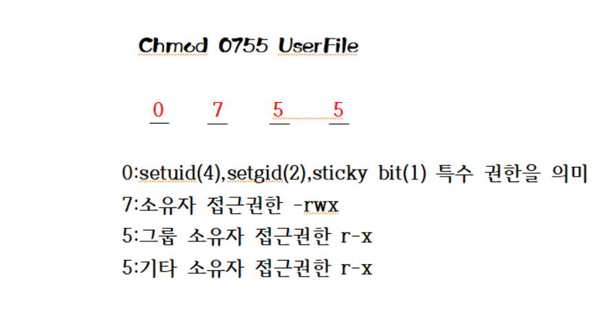
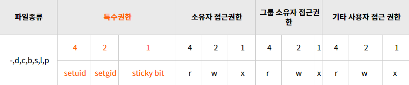

## 파일과 디렉토리

리눅스에서는 파일과 디렉토리를 따로 구분하지 않는다.

### 파일의 종류

- 일반적인 파일: 이진 파일, 문서 파일
    - 실행 파일, 압축 파일, 바로 가기(Sysmbolic link)
- 디렉토리 파일
    - 부모 디렉토리(..), 서브 디렉토리(./), 루트 디렉토리(/), 홈 디렉토리(~)
- 디바이스 드라이버 파일: /dev
    - console: 시스템에 연결된 모니터나 키보드와 같은 입출력 장치
    - lp*: 프린터를 연결하여 사용하는 병렬 포트
    - null: 어떤 프로그램이나 명령의 출력 결과를 출력하고 싶지 않을 때
    - sd*: scsi 장치
    - tty*: 가상 터미널
    - ttyS*: 시리얼 포트
- inode (Information Node)
    - 파일에 대한 정보(메타데이터)를 포함하고 있고, 인덱스 값도 가진 노드(데이터)이다.
    - **한 파일이 사용하는 블록들을 가리키는 포인터를 포함**하는 하나의 블록(데이터를 저장하는 단위)이다.
    - ex) 자기가 담당하고 있는 파일이 있는데, 그 파일이 사용하는 모든 블록을 가리킨다.
    - **하나의 파일이 여러 데이터 블록을 가질 수 있다.**
    
    ```jsx
    아이노드가 가지고 있는 정보
    - 파일 모드(퍼미션)
    - 링크 수
    - 소유자명
    - 그룹명
    - 파일 크기
    - 파일 주소
    - 마지막 접근 정보
    - 마지막 수정 정보
    - 아이노드 수정 정보
    ```
    

### 디렉토리 구조

- / : 루트 디렉토리
- /bin : Binaries 의 약자, 실행 가능한 파일과 시스템을 운영하기 위한 기본적인 명령어들이 모여있다.
- 부팅에 핵심적인 커널 이미지와 부팅 정보 파일을 담고 있는 디렉토리, /etc/lilo.conf 에서 지정한 커널 부팅 이미지 파일이 들어 있으면 부팅 시 매우 중요한 역할을 한다.
- /dev : 물리적 장치를 접근하기 위한 디바이스 파일, 연결되어 있는 장치의 정보를 확인할 수 있다.
- /etc : 시스템 설정 및 초기화에 필요한 파일, 네트워크 관련 설정 파일, 사용자 정보 및 암호 정보, 파일 시스템 정보, 보안 파일 등이 있다.
- /home : 리눅스 사용자의 홈 디렉토리(사용자 계정명과 동일)가 만들어지는 디렉토리
- /proc : 시스템 관리를 위해 메모리 상에 만들어놓은 가상의 디렉토리
- /sbin : 주로 시스템 운영에 필요한 파일 – /usr : 사용자들이 UNIX를 사용하면서 필요한 파일
    - /usr/bin: /bin 디렉토리에서 찾을 수 없는 실용적인 프로그램
    - /usr/include: C 프로그램 컴파일을 위한 헤더 파일
    - /usr/man: man page를 출력하는 데 필요한 파일
- /sys : 리눅스 커널관련 정보가 있는 디렉토리
- /var : 시스템 로그 정보 및 메일이나 cron 정보가 저장된다.
- /tmp: 시스템 사용 중에 발생한 임시 데이터가 저장되는 디렉토리, 부팅 시 초기화된다.
- /root : 시스템 관리자의 home 디렉토리, 일반 사용자가 접근할 수 없다.

## 파일 속성

- ex) rw-r--r-- 1 user1 staff 13 Jun 17 11:29 test.txt
    - - : 파일종류(일반파일 : -, 디렉토리 : d)
    - rw-r--r-- : 파일 접근 권한
    - 1 : 하드링크 수
    - user1 : 파일 소유자 계정 ID
    - staff : 파일 소유자의 그룹
    - 13 : 파일의 크기(byte)
    - Jun 17 11:29 : 마지막 수정 일시
    - test.txt : 파일명

### 파일의 접근 권한





- 권한 대상 : 소유자, 그룹, 그 외 사용자
- 권한 종류
    - 읽기(r) : 파일을 읽고 복사 할 수 있음
    - 쓰기(w) : 수정, 이동, 삭제 가능
    - 실행(x) : 이동, 복사, 실행 가능
- 표기 방법
    - 3가지 대상을 각각 3개 문자로 나열
- 권한 변경
    - chmod (-R) ‘파일권한’ ‘디렉토리명 or 파일명’  : 해당 파일, 디렉토리의 권한 설정
    - 기호 표현법
        - u : 소유자, g : 그룹, o : 그룹 외 사용자, a : 모든 사용자
        - + : 권한 부여, - : 권한 제거, = : 권한 설정
        - ex) chmod uo-w test.txt ⇒ 소유자인 그룹 외 사용자의 쓰기 권한을 제거한다.
    - 숫자 표현법
        - 각 대상의 권한을 8진수로 환산
        - 읽기는 4, 쓰기는 2, 실행은 1로 나타내며 필요한 권한은 더해서 지정한다.
        - ex) chmod 744 test.txt ⇒ 사용자에게는 모든 권한을 주고, 그룹, 다른 사용자에게는 읽기 권한만 준다.
- setUID
    - 파일을 실행했을 때 해당 파일이 프로세스로 실행되는 동안은 현재 접속한 사용자의 권한이 아닌 해당 파일의 소유자 권한으로 실행되도록 하기 위해 사용한다.
    - ex) 현재 접속한 사용자가 root이고 SetUID가 설정된 파일의 소유자가 centos 라는 계정이라면 root가 아닌 centos 계정의 권한으로 실행된다.
- setGID
    - 파일 또는 디렉터리를 실행시에 해당 파일 및 디렉터리의 소유 그룹의 권한을 갖게 되는 퍼미션(drwx) 설정이다.
    - SetGID가 적용되면 그룹 실행 권한에 rwx에서 rwS로 변경된다.
- Sticky Bit
    - 파일을 작성할 수는 있지만 다른 사용자의 파일을 지우지 못하게 할 수 있다.
    - Sticky Bit를 쓰는 이유
        - 디렉터리 o(other)에 ‘wx’ 권한이 있으면 디렉터리 내에 있는 파일 o(other)에 ‘rwx’권한이 없어도 다른 유저가 파일을 강제로 변환할 수 있다.
        - 디렉터리 o(other)에 ‘wx’ 권한이 없으면 소유자와 그룹에 속한 사람들 말고는 디렉토리 사용이 불가능하다.
        - 누구라도 디렉토리 사용은 할 수 있지만 디렉터리 내에 파일은 건들지 못하게 하기 위해 Sticky Bit 개념을 사용하는 것이다.