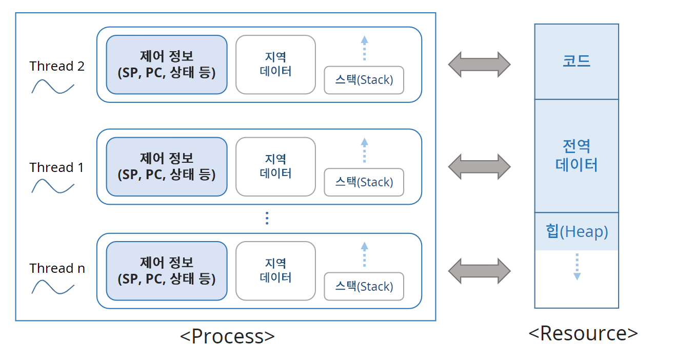

## 프로세스와 쓰레드

- 프로세스가 하는 일은 자원을 할당 받고 제어해서 원하는 목적을 달성하는 것
- 프로세스를 할당, 제어로 역할을 나눌 수 있는데 여기서 제어는 쓰레드라고 한다.
- 하나의 프로세스에 쓰레드는 여러개이다.
  - 하나의 자원에 여러 제어가 있다.
## 쓰레드
- Light Weight Process(LWP)라고 부른다.
  - 자원은 공유하고 제어부분만 가지고 있어서 프로세스보다 가볍다.

- 하나의 프로세스에 쓰레드는 여러 개이다.
- 각 쓰레드는 할당받은 일을 처리한다.
- 프로세스가 할당받은 리소스는 공유한다.
### 프로세스의 메모리 공간

- 각 쓰레드마다 자기만의 작업영역(Stack)을 가지게 된다.
- 쓰레드는 stack에서 지역 데이터를 만들고 작업을 한다.

